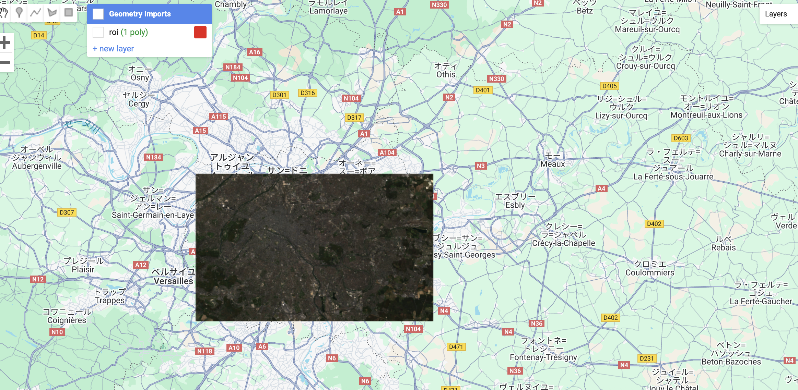

# Clipping Images - GEE Learning Log

This note summarizes the learning from **Section 5 - Lecture 14: Clipping Images** of the [Google Earth Engine Mega Course](https://www.udemy.com/course/google-earth-engine-gis-remote-sensing/learn/lecture/42661280#overview).

---

## What This Script Does

- Loads Sentinel-2 SR (Harmonized) imagery
- Filters by:
  - Region of interest (ROI)
  - Cloud coverage less than 20% using `CLOUD_COVERAGE_ASSESSMENT`
  - Date range: January to June 2022
- Selects natural color bands (B4, B3, B2)
- Applies `.median()` to create a cloud-reduced composite
- Applies `.divide(10000)` to rescale reflectance to 0–1 range
- Clips the image to the defined ROI
- Displays both the full image and the clipped version on the map

---

## Key GEE Concepts Used

| Concept                           | Purpose                                                          |
|-----------------------------------|------------------------------------------------------------------|
| `ee.ImageCollection()`            | Load Sentinel-2 surface reflectance imagery                      |
| `.filterBounds()`                 | Limit to region of interest                                      |
| `.filterMetadata()`               | Filter by cloud cover metadata field                             |
| `.filterDate()`                   | Filter by specific date range                                    |
| `.select(["B4", "B3", "B2"])`     | Select visible bands for RGB composite                          |
| `.median()`                       | Create a single cloud-reduced composite image                    |
| `.divide(10000)`                  | Convert scaled integers to reflectance between 0 and 1           |
| `.clip(roi)`                      | Crop the image to the region of interest                         |
| `Map.addLayer()`                  | Display imagery on the map                                       |

---

## Output


This script produces a clipped version of the raw median composite composite  of Sentinel-2 imagery limited to the ROI

---

## Notes

## What does `.median()` do?

It combines multiple images over time into a single image by computing the median value for each pixel.
This helps reduce cloud effects and outliers by avoiding extreme values.

### What does `.divide(10000)` do?

Sentinel-2 reflectance data is stored as scaled integers (e.g., 10000 = 1.0 reflectance).  
This operation converts it to real reflectance between 0 and 1.

### Why does `filterMetadata()` look different when using Landsat and Sentinel-2?

Different datasets use different metadata field names

- Landsat → CLOUD_COVER
```javascript
.filterMetadata("CLOUD_COVER", "less_than", 10)
```

- Sentinel-2 → CLOUD_COVERAGE_ASSESSMENT
```javascript
.filterMetadata("CLOUD_COVERAGE_ASSESSMENT", "LESS_THAN", 20)
```

* The comparison keyword ("LESS_THAN" vs "less_than") is case-sensitive in GEE, but both forms work similarly depending on context.


## 🔗 References
- Udemy Course: [Google Earth Engine Mega Course](https://www.udemy.com/course/google-earth-engine-gis-remote-sensing/learn/lecture/42661280#overview)
- GEE Dataset: [Harmonized Sentinel-2 MSI: MultiSpectral Instrument, Level-2A (SR)](https://developers.google.com/earth-engine/datasets/catalog/COPERNICUS_S2_SR_HARMONIZED?hl=ja)

