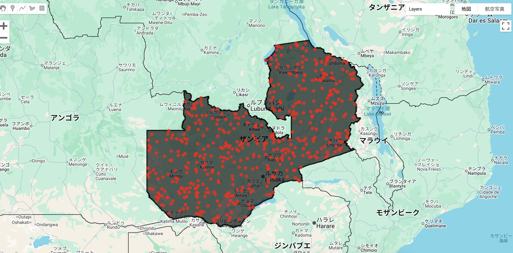

# Feature Collection - GEE Learning Log

This note summarizes the learning content from Section 5 - Lecture 13: Feature Collection of the [Google Earth Engine Mega Course](https://www.udemy.com/course/google-earth-engine-gis-remote-sensing/learn/lecture/42661268#overview).

---

## What This Script Does

- Loads the LSIB 2017 international boundary dataset
- Filters to extract the geometry for Zambia
- Uses `ee.FeatureCollection.randomPoints()` to generate 500 random points within the country's boundaries
- Visualizes the sampled points in red over the Zambia polygon

---

## Key GEE Concepts Used

| Concept                          | Purpose                                                       |
|----------------------------------|---------------------------------------------------------------|
| `ee.FeatureCollection()`         | Load LSIB 2017 boundary data                                  |
| `.filter(ee.Filter.eq(...))`     | Extract a specific country (Zambia)                           |
| `.randomPoints(region, count)`   | Generate a given number of random points inside a region      |
| `Map.addLayer()`                 | Display vector layers                                         |
| `Map.centerObject()`            | Zoom the map view to the region                               |

---

## Output

This script generates a visual output with:

- A filtered boundary of Zambia using LSIB data
- 500 random points distributed within the ROI polygon
- Points styled in red

### Output

---

## Notes

### What does randomPoints() do?
`randomPoints()` simulate sample locations or pseudo field points.
This is useful for preparing training data for classification or validation sampling.

## 🔗 References
- Udemy Course: [Google Earth Engine Mega Course](https://www.udemy.com/course/google-earth-engine-gis-remote-sensing/learn/lecture/42661268#overview)
- GEE Dataset: [LSIB 2017: Large Scale International Boundary Polygons, Simplified](https://developers.google.com/earth-engine/datasets/catalog/USDOS_LSIB_SIMPLE_2017)
