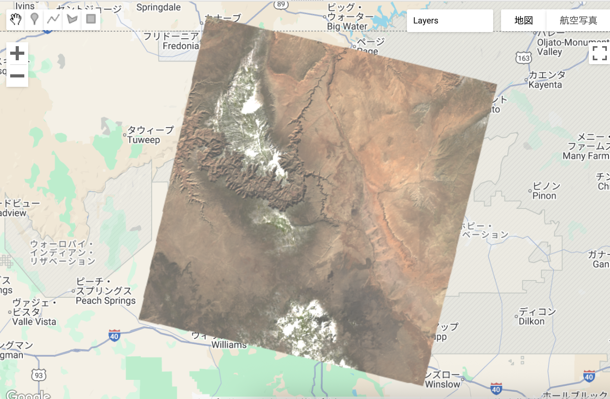
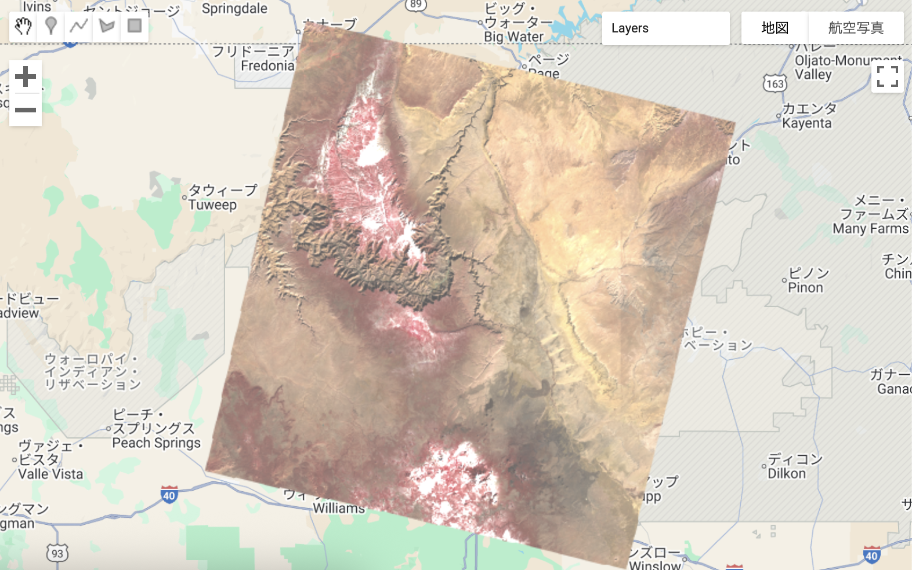

#  Image Visualization with Landsat 9 – GEE Learning Log

This note summarizes what was learned in **Section 5 - Lecture 10: Image Visualization** of the [Google Earth Engine Mega Course](https://www.udemy.com/course/google-earth-engine-gis-remote-sensing/learn/lecture/42661196#overview).

---

## What This Script Does
- Loads Landsat 9 imagery for early 2022
- Filters by region of interest (Utah, USA) and date range
- Sorts by cloud cover and selects the clearest image
- Displays the image using two visualizations:
  - **True Color (432)**: Natural RGB view
  - **False Color (543)**: Highlights vegetation (commonly used in remote sensing)
---

## Key GEE Concepts Used

| Concept                | Purpose                                     |
|------------------------|---------------------------------------------|
| `ee.Geometry.Point`    | Define region of interest (ROI)             |
| `ee.ImageCollection`   | Load Landsat image series                   |
| `.filterDate()`        | Limit to a specific time range              |
| `.filterBounds()`      | Limit to area around the ROI                |
| `.sort("CLOUD_COVER")` | Prefer less cloudy images                   |
| `.first()`             | Pick the clearest available image           |
| `Map.addLayer()`       | Display imagery with color visualization    |
| `Map.centerObject()`   | Zoom to the image area                      |

---

## Output Samples

### True Color Composite (Bands 4-3-2)


### False Color Composite (Bands 5-4-3)


---

## Notes

### Why are `min` and `max` parameters required?

Earth observation imagery (like Landsat) stores data in numeric values that represent the intensity of light reflected by the Earth's surface. 
But GEE can’t automatically know how to visualize this unless we tell it the range of brightness values to stretch between black and white.

- `min`: defines the darkest value (anything below appears black)
- `max`: defines the brightest value (anything above appears white)
- Values between `min` and `max` are mapped into visible colors on screen

Landsat 9 surface reflectance typically ranges from 0 to ~20000, so specifying:

```javascript
min: 0, max: 20000
```
helps make the image look clear and balanced — not too dark or washed out.

## 🔗 References
- Udemy Course: [Google Earth Engine Mega Course](https://www.udemy.com/course/google-earth-engine-gis-remote-sensing/learn/lecture/42661196#overview)
- Google Eearth Engine： [Landsat 9 Dataset](https://developers.google.com/earth-engine/datasets/catalog/landsat-9)
