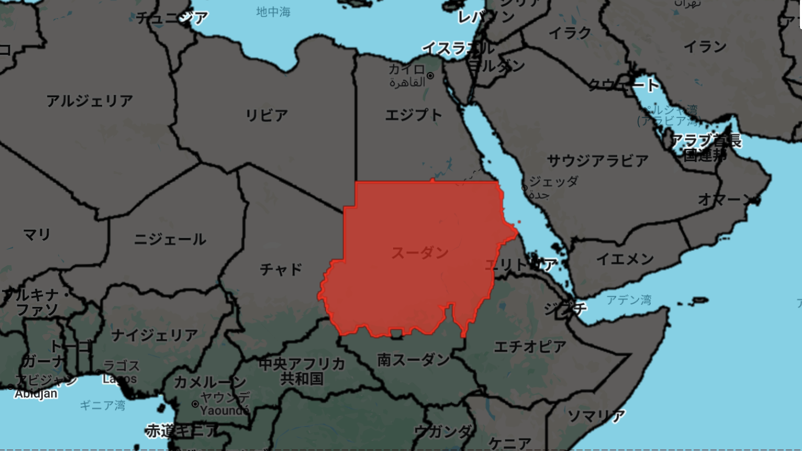

# Importing Shapefiles into Google Earth Engine — GEE Learning Log

This note summarizes the learning from Section 6: "Import Shapefiles" in the [GEE Mega Course](https://www.udemy.com/course/google-earth-engine-gis-remote-sensing/learn/lecture/42661316#overview).

---

## What This Script Does

- Loads an administrative boundary shapefile from the World Bank
- Imports it as a FeatureCollection from Earth Engine Assets
- Visualizes all countries on the map
- Filters and highlights a single country (Sudan) in red
- Recenters the map on the selected country

---

## Key Concepts

| Concept                        | Description |
|-------------------------------|-------------|
| `ee.FeatureCollection()`       | Loads shapefile as a feature dataset |
| `filter()` + `ee.Filter.eq()`  | Selects a single country by attribute |
| `Map.addLayer()`               | Displays vector data on the map |
| `Map.centerObject()`           | Moves the map to the selected feature |
| `style()`                      | Customizes border and fill colors |

---

## Output

The result is a map that:

- Displays all countries from the World Bank shapefile
- Highlights **Sudan** in red
- Uses semi-transparent red fill for easy viewing

### Preview Image

---

## Notes

### Why does `"NAM_0"` work for filtering?

Shapefile attributes vary depending on the source. In this World Bank dataset:

- The field storing English country names is called `"NAM_0"`, not `"NAME_EN"`.

Use `.limit(10)` and `print()` to explore the correct property names before filtering.

### Which file should I upload from the World Bank?

Download the "World Bank Official Boundaries (Shapefiles)" and use "World Bank Official Boundaries - Admin 0" file from the World Bank Data Catalog.

Extract the contents. You must upload the following 4 files together to Earth Engine Assets:

- `.shp` — shape geometry file
- `.shx` — shape index file
- `.dbf` — attribute data file
- `.prj` — projection metadata

Do not upload formats like .geojson, .gpkg, or .kml directly — these are not supported for Earth Engine Asset Uploads. Convert them to shapefiles if needed.

Note: Replace 'YOUR_ASSET_PATH_HERE' in the script with your own Earth Engine asset path, such as 'users/YOUR_USERNAME/assets/WB_countries_Admin0'.

---

## Summary

This process allows you to:

- Upload any shapefile to GEE
- Filter and visualize features
- Build country-level visualizations using custom styling
  
Note: Replace `'YOUR_ASSET_PATH_HERE'` with your actual Earth Engine asset path  
(e.g., `'users/your_username/assets/WB_countries_Admin0'`)

## 🔗 References
- Udemy Course: [Google Earth Engine Mega Course](https://www.udemy.com/course/google-earth-engine-gis-remote-sensing/learn/lecture/42661316#overview)
- World Bank　Data Catalog: [World Bank Official Administrative Boundaries](https://datacatalog.worldbank.org/search/dataset/0038272/World-Bank-Official-Boundaries)
