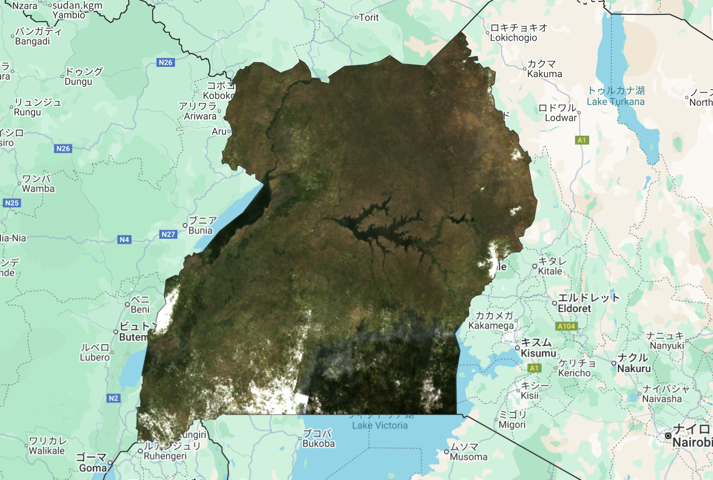
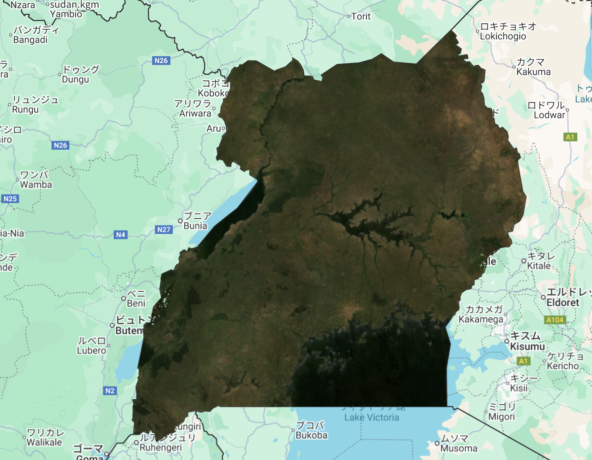

# Advanced Cloud Masking - GEE Learning Log

This note summarizes the learning from Section 6: "Advanced Cloud Masking" in the [Google Earth Engine Mega Course](https://www.udemy.com/course/google-earth-engine-gis-remote-sensing/learn/lecture/42661424#overview).

---

## What This Script Does

- Loads Landsat 8 imagery over Uganda for 2022
- Applies advanced cloud masking using the `QA_PIXEL` bitmask band
- Filters out both clouds and cloud shadows using bitwise operations
- Applies scaling factors to convert raw data to reflectance and temperature
- Produces two composites:
  - A raw median composite
  - A cloud-free median composite
- Visualizes both on the map using RGB bands

---

## Key Concepts

| Concept                          | Description |
|----------------------------------|-------------|
| `QA_PIXEL` band                  | Stores bit flags (e.g., cloud, shadow, fill) |
| Bitwise masking (`1 << bit`)     | Isolates cloud (bit 3) and cloud shadow (bit 4) |
| `updateMask()`                   | Masks out unwanted pixels |
| `applyScaleFactors()`            | Converts DN values to reflectance/temperature |
| `.median()`                      | Reduces multiple images into a single composite |

---

## Output

Two layers will be displayed:

### Raw Composite

### Cloud-Free Composite

---

## Notes

### What was learned?

- Advanced cloud masking can be implemented using QA_PIXEL metadata
- Using bitwise flags allows precise exclusion of unwanted pixels (clouds and shadows)

### What is `QA_PIXEL`?
A bitmask band in Landsat data. Each bit represents a specific quality flag (e.g., cloud, fill, shadow). Used for pixel-level filtering.

### Why use `bitwiseAnd(1 << 3)` and `(1 << 4)`?
This operation checks whether specific bits (bit 3 = cloud, bit 4 = cloud shadow) are set. If not set (= 0), the pixel is cloud/shadow-free.

### When to use this method vs. `simpleComposite()`?
`simpleComposite()` (used in basic cloud masking) is easier but less customizable. Bitmasking via QA_PIXEL gives more control and accuracy.

---

## Reference
- [Google Earth Engine Mega Course](https://www.udemy.com/course/google-earth-engine-gis-remote-sensing/learn/lecture/42661424#overview)

