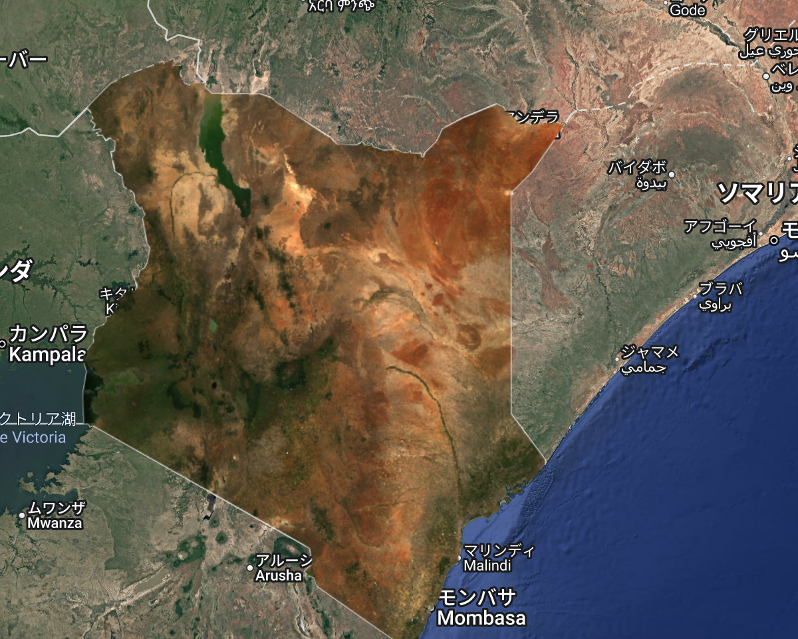
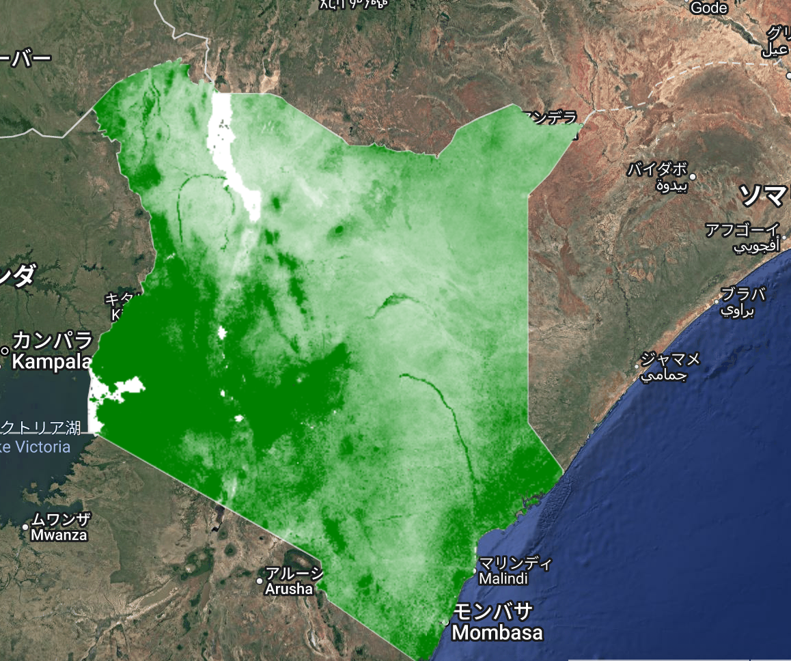
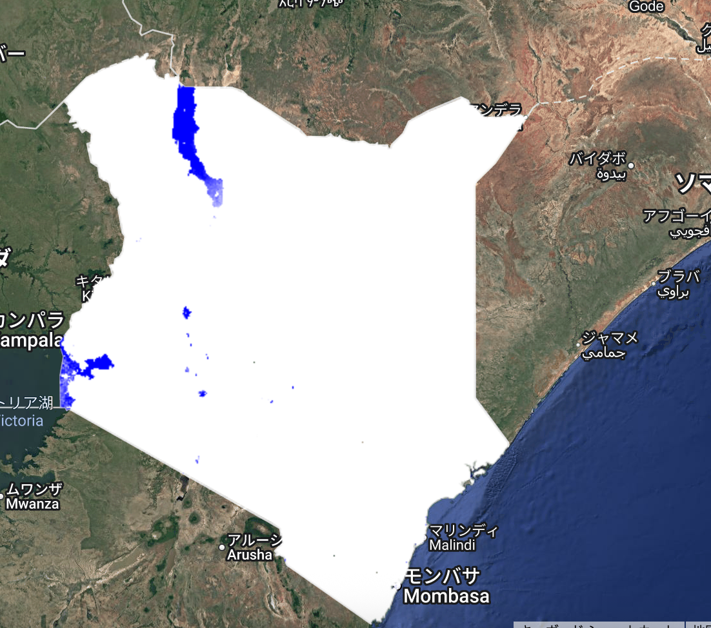
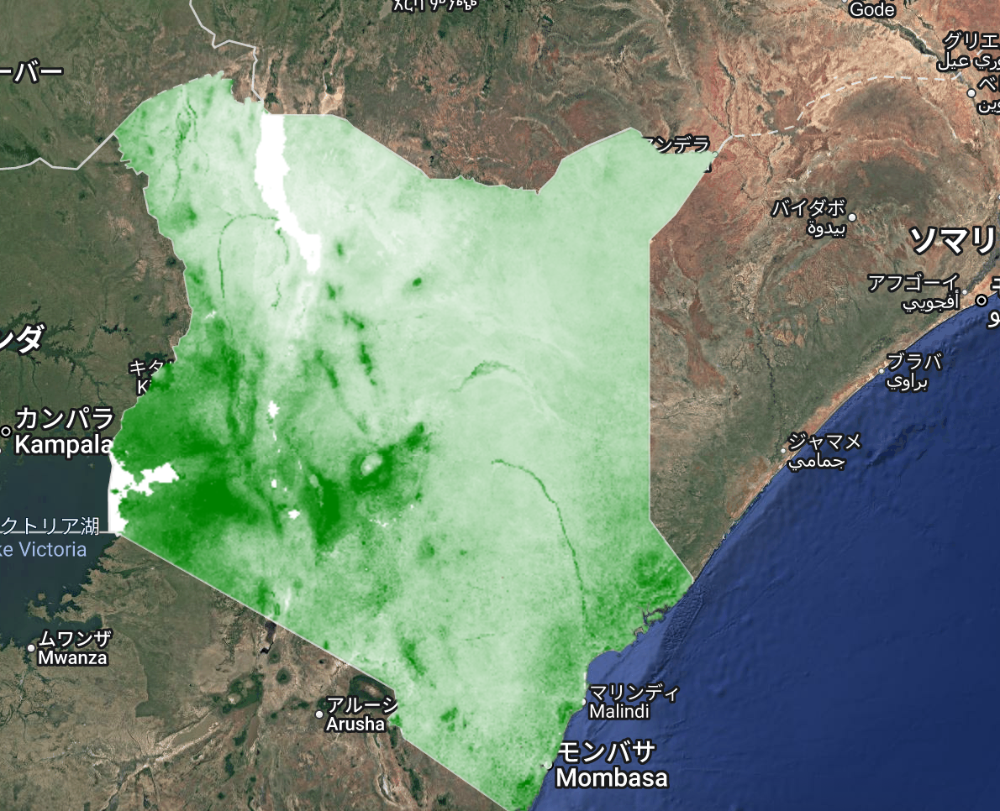

# Spectral Indices (NDVI, EVI, MNDWI) – GEE Learning Log

This note summarizes the learning from Section 7: "Calculate Spectral Indices" in the [GEE Mega Course](https://www.udemy.com/course/google-earth-engine-gis-remote-sensing/learn/lecture/42661444).

---

## What This Script Does

- Loads Landsat 8 Collection 2 Surface Reflectance images over Kenya (2021)
- Applies cloud and saturation masking using `QA_PIXEL` and `QA_RADSAT`
- Applies scale factors for optical and thermal bands
- Calculates three spectral indices:
  - NDVI (Normalized Difference Vegetation Index)
  - EVI (Enhanced Vegetation Index)
  - MNDWI (Modified Normalized Difference Water Index)
- Visualizes each index and the RGB image using appropriate color palettes

---

## Key Concepts

| Concept                 | Description                                            |
|------------------------|--------------------------------------------------------|
| `normalizedDifference()` | Calculates normalized ratio of two bands             |
| `image.expression()`     | Enables writing mathematical expressions using bands |
| `palette`                | Defines color ramp for visualization                 |

---

## Output

The following layers are displayed on the map:

- Natural color Landsat 8 RGB image (bands 4-3-2)
- NDVI (vegetation index) visualized in white → green
- MNDWI (water index) visualized in white → blue
- EVI (vegetation index with improved soil/cloud sensitivity) in white → green

### True Color Composite


### NDVI Map


### MNDWI Map


### EVI Map


---

## Notes

### 1. What is `QA_PIXEL` and `QA_RADSAT`?

- `QA_PIXEL` is a quality assurance band. Specific bits in this band indicate cloud, shadow, fill pixels, etc.
- `QA_RADSAT` flags radiometric saturation.

### 2. What are `qaMask` and `saturationMask` doing?

These masks extract relevant QA flags using `bitwiseAnd` and help exclude bad pixels.

- `qaMask` uses the `QA_PIXEL` band to mask out unwanted pixels such as clouds, cloud shadows, cirrus, and fill.  
  It applies a bitmask to keep only pixels where Bits 0–4 are all zero (i.e., clean).

```javascript
Bit 0 - Fill
Bit 1 - Dilated Cloud
Bit 2 - Cirrus 
Bit 3 - Cloud
Bit 4 - Cloud Shadow
```

- `saturationMask` uses the `QA_RADSAT` band to remove pixels that are saturated in any band.
`.eq(0)` ensures that only non-saturated pixels are retained.

Together, these masks keep only high-quality, cloud-free, and valid pixels for further processing.

### 3. What does `image.normalizedDifference()` do? 
It calculates an index using the formula  `(A - B) / (A + B)`.
For example, NDVI = (NIR - RED) / (NIR + RED).

### 4. What is `image.expression()`?
It allows you to manually define a formula using bands and math.
Useful for complex indices like EVI.

### 5. What is `palette: ["white", "green"]`?
This creates a color gradient:
- Low values (min) are shown in white
- High values (max) are shown in green

Resulting in a smooth white → green transition.

---

## Reference
- **Udemy**：[Google Earth Engine Megacourse](https://www.udemy.com/course/google-earth-engine-gis-remote-sensing/learn/lecture/42661444#overview)
- **Google Earth Engine Data Catalog**：[LSIB 2017: Large Scale International Boundary Polygons, Simplified](https://developers.google.com/earth-engine/datasets/catalog/USDOS_LSIB_SIMPLE_2017?hl=ja)

