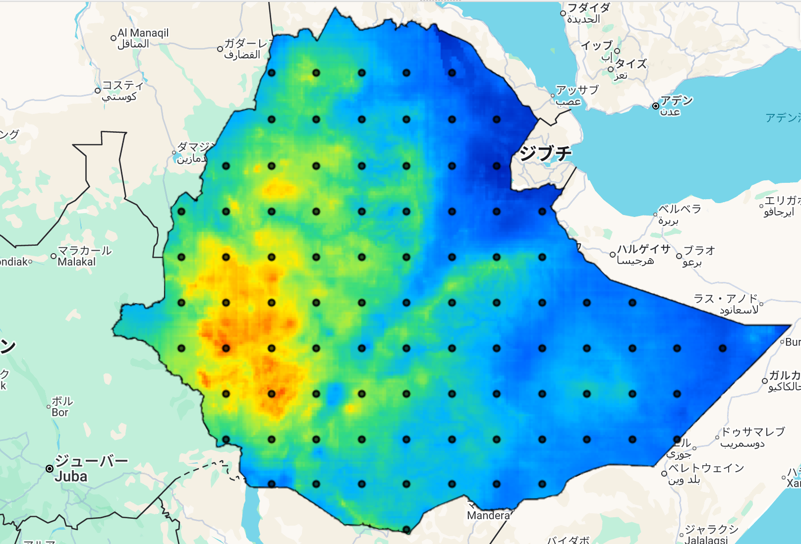
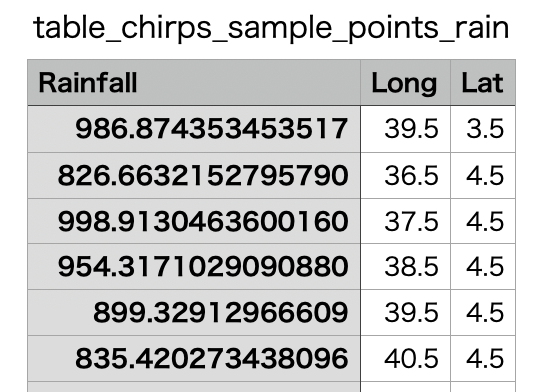

# Extract Sample Points – GEE Learning Log

This note summarizes the learning from Section 8: "Extract Sample Points" in the [GEE Mega Course](https://www.udemy.com/course/google-earth-engine-gis-remote-sensing/learn/lecture/42661600#overview).

---

## What This Script Does

- Loads CHIRPS PENTAD rainfall data (5-day accumulation) over Ethiopia for 2023
- Computes total annual precipitation by summing all pentads
- Samples precipitation values as points across the country
- Extracts rainfall value along with longitude and latitude per point
- Exports the resulting sample points as a CSV

---

## Key Concepts

| Concept                  | Description |
|--------------------------|-------------|
| `CHIRPS/PENTAD`          | Rainfall estimates in 5-day intervals (pentads) |
| `reduce(ee.Reducer.sum())` | Combines multiple images (e.g. 73 pentads) into total rainfall |
| `.projection()`          | Returns image's spatial reference system |
| `.nominalScale()`        | Returns pixel resolution in meters |
| `.sample()`              | Extracts raster values into points over a region |
| `.map(function)`         | Adds new attributes like Lat, Long, and Rainfall to each point |
| `Export.table.toDrive()` | Exports feature collection as CSV |

---

## Output

### Rainfall Map (CHIRPS PENTAD 2023)


### Sample CSV (Sample)


---

## Notes

###  1. What is the difference between CHIRPS Daily and CHIRPS PENTAD?

| Dataset | Interval | Use Case |
|--------|----------|----------|
| CHIRPS/DAILY | Daily (365 images/year) | Fine-grained drought tracking, short-term anomalies |
| CHIRPS/PENTAD | Every 5 days (73 images/year) | Smoothed signal, faster processing, suitable for coarse summaries |

→ PENTAD is faster to process but less temporally detailed.

#### 2. What does `.reduce(ee.Reducer.sum())` do?

- It aggregates all images (pentads) by summing pixel values.
- Each band value = rainfall over 5 days → sum gives annual rainfall.

#### 3. What is `.projection()` and `.nominalScale()`?

- `.projection()` returns the coordinate system used by the image.
- `.nominalScale()` returns the pixel size (e.g. ~5000m for CHIRPS).
- Used to ensure point sampling is aligned with raster resolution.

#### 4. What does this block do?

```javascript
rainfallSamples = rainfallSamples.map(function(feature){
  var geom = feature.geometry().coordinates();
  return ee.Feature(null,{
    "Rainfall": ee.Number(feature.get("precipitation_sum")),
    "Long": ee.Number(geom.get(0)),
    "Lat": ee.Number(geom.get(1))
  });
});
```
This block adds custom properties to each point feature in the sampled rainfall dataset:
| Property   | Description                                             |
| ---------- | ------------------------------------------------------- |
| `Rainfall` | The total precipitation at the sampled location (in mm) |
| `Long`     | Longitude of the point (X coordinate)                   |
| `Lat`      | Latitude of the point (Y coordinate)                    |

These attributes are useful when exporting to CSV format, allowing further use in:

- Spreadsheet software (Excel, Sheets)
- GIS software (QGIS, ArcGIS)
- Data visualization tools (Tableau, Power BI)

---

## Reference

- **Udemy Course**:  
  [Google Earth Engine Mega Course – Section 7: Extract Sample Points](https://www.udemy.com/course/google-earth-engine-gis-remote-sensing/learn/lecture/42661600)

- **Datasets Used**:
  - [CHIRPS PENTAD – Climate Hazards Group InfraRed Precipitation with Station data (5-day)]  
    Dataset ID: `UCSB-CHG/CHIRPS/PENTAD`  
    [GEE Data Catalog →](https://developers.google.com/earth-engine/datasets/catalog/UCSB-CHG_CHIRPS_PENTAD?hl=ja)
  
  - [USDOS/LSIB_SIMPLE/2017 – Large Scale International Boundaries (Simplified)]  
    Dataset ID: `USDOS/LSIB_SIMPLE/2017`  
    [GEE Data Catalog →](https://developers.google.com/earth-engine/datasets/catalog/USDOS_LSIB_SIMPLE_2017)

