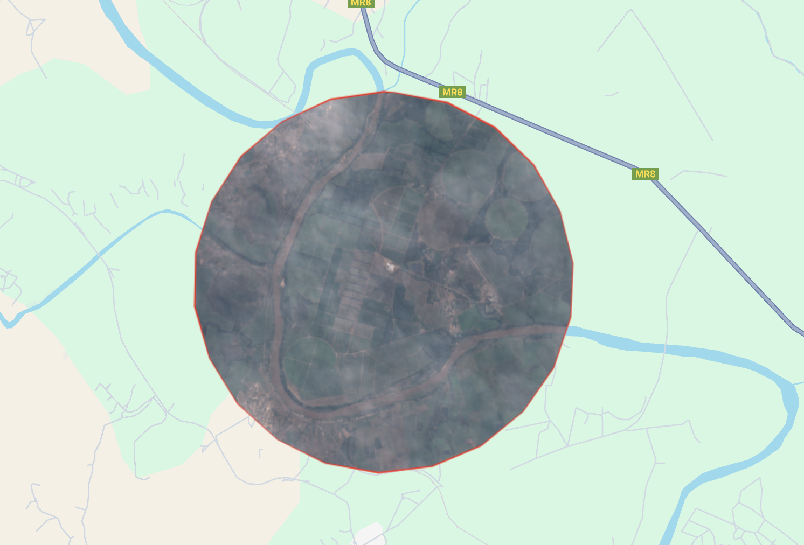
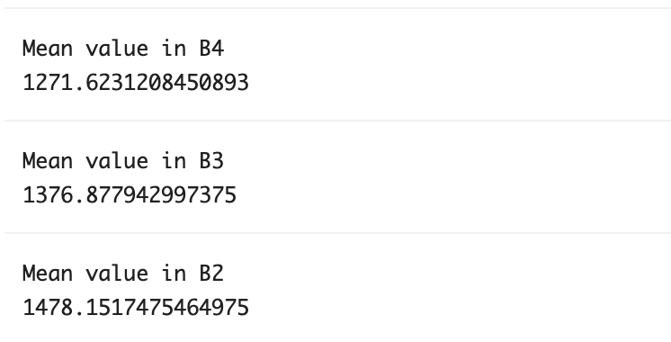

# Image Mean Reduction – GEE Learning Log

This note summarizes the learning from Section 7: "Reduces" in the [GEE Mega Course](https://www.udemy.com/course/google-earth-engine-gis-remote-sensing/learn/lecture/42661474#overview).

---

## What This Script Does

- Loads Sentinel-2 imagery over a 3 km buffered point in southern Africa
- Filters image collection by date (2019), cloud cover (<30%), and area
- Computes pixel-wise mean over time using `.reduce(ee.Reducer.mean())`
- Displays the RGB mean composite of the image collection
- Extracts the average reflectance in B4, B3, B2 within the ROI using `.reduceRegion()`

---

## Key Concepts

| Concept                 | Description                                                  |
|------------------------|--------------------------------------------------------------|
| `reduce()`             | Applies a reducer (e.g. mean, median) across an image collection |
| `reduceRegion()`       | Computes statistics (e.g. mean) over a specific region        |
| `ee.Reducer.mean()`    | Reducer that calculates mean values                          |
| `buffer()`             | Creates a circular area around a point                       |
| `select("B.*")`        | Selects all Sentinel-2 bands (B1–B12)                        |

---

## Output

### RGB Mean Composite

### Individual Bands (Mean Value)

---

## Notes

### What was the purpose of this script?
It demonstrates how to aggregate time-series imagery into a single mean composite.  
This is useful to smooth out clouds or noise and visualize average surface conditions 
(e.g., average vegetation, land cover).

### What does `.reduce()` do on an ImageCollection? 
It combines all images into one image by applying a function (like mean) to each pixel across time.

### What does `.reduceRegion()` do?
It calculates the average value of selected bands over a specified region of interest (ROI).

---

## Reference

- **Udemy:** [Google Earth Engine Mega Course – Section 7](https://www.udemy.com/course/google-earth-engine-gis-remote-sensing/learn/lecture/42661474)
- **GEE Dataset:** [COPERNICUS/S2_HARMONIZED – Sentinel-2 Surface Reflectance](https://developers.google.com/earth-engine/datasets/catalog/COPERNICUS_S2_HARMONIZED)
