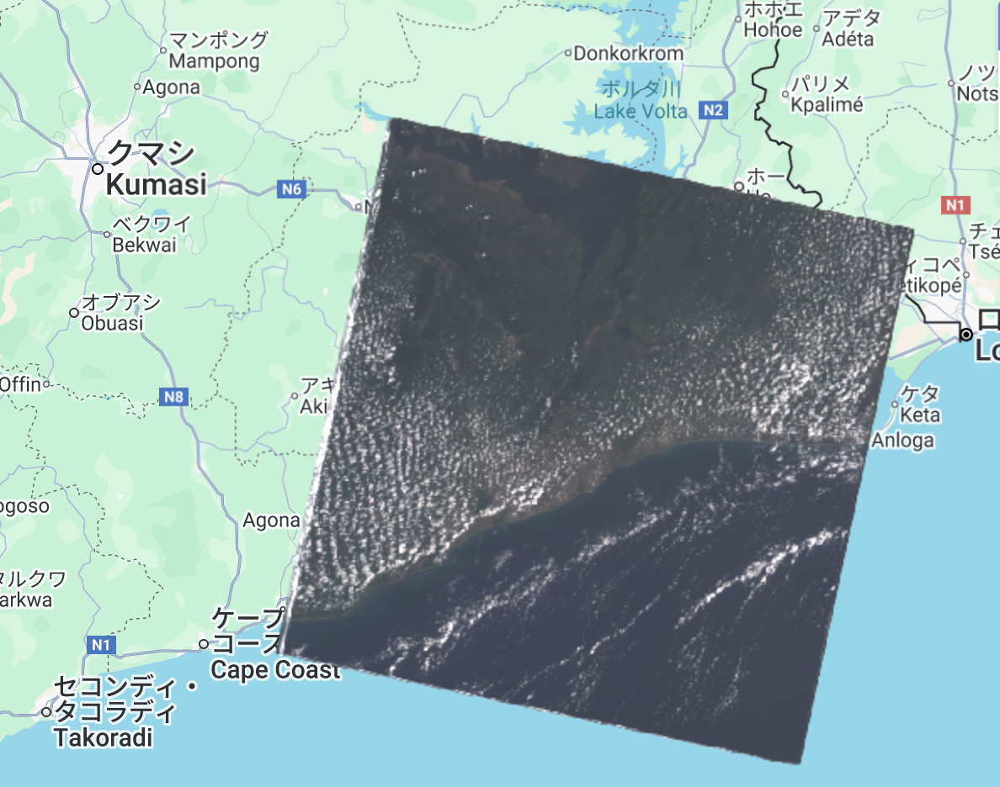

# Simple Cloud Masking - GEE Learning Log

This note summarizes the learning from Section 6: "Simple Cloud Masking" in the [GEE Mega Course](https://www.udemy.com/course/google-earth-engine-gis-remote-sensing/learn/lecture/42661424#overview).

---

## What This Script Does

- Loads raw Landsat 8 Level-1 imagery
- Filters by:
  - Location (a point in West Africa)
  - Time range (January–December 2020)
- Creates a cloud-free composite using `ee.Algorithms.Landsat.simpleComposite()`
- Applies two different visualization styles:
  - Cloud-free composite with reflectance values scaled to 0–1
  - Raw image composite using DN values (0–30000)

---

## Key Concepts

| Concept                                   | Description |
|------------------------------------------|-------------|
| `ee.ImageCollection()`                    | Loads Landsat image collection |
| `.filterBounds()`                         | Filters by location |
| `.filterDate()`                           | Filters by date range |
| `ee.Algorithms.Landsat.simpleComposite()` | Creates a cloud-free composite image |
| `asFloat: true`                           | Converts bands to float values (scaled reflectance 0–1) |
| `Map.addLayer()`                          | Visualizes both the original and cloud-masked images |

---

## Output

This script displays two layers:

### 1. Raw Cloudy Imagery

### 2. Cloud-Free Composite

---

## Notes

### What was new?
Learned how to generate a simple cloud-masked image using just one line of code via `ee.Algorithms.Landsat.simpleComposite()`

### What does `asFloat: true` mean?  
This option tells Earth Engine to convert the image's Digital Number (DN) values to floating point reflectance values between 0 and 1.  
If not set, the image stays in its raw DN format (e.g. 0–30000).

### Why are `min` and `max` different for `cloudFreeVis` and `cloudyVis`?
Because `cloudFree` has been converted to reflectance (0–1) using `asFloat: true`, while `cloudyImage` uses raw DN values (up to ~30000).  
Setting appropriate `min` and `max` ensures that GEE displays the images with correct contrast and brightness.

## Reference
- Udemy: [Google Earth Engine Mega Course](https://www.udemy.com/course/google-earth-engine-gis-remote-sensing/learn/lecture/42661424#overview)
- Google Earth Engine Data Catalog: [USGS Landsat 8 Level 2, Collection 2, Tier 1](https://developers.google.com/earth-engine/datasets/catalog/LANDSAT_LC08_C02_T1_L2?hl=ja)
