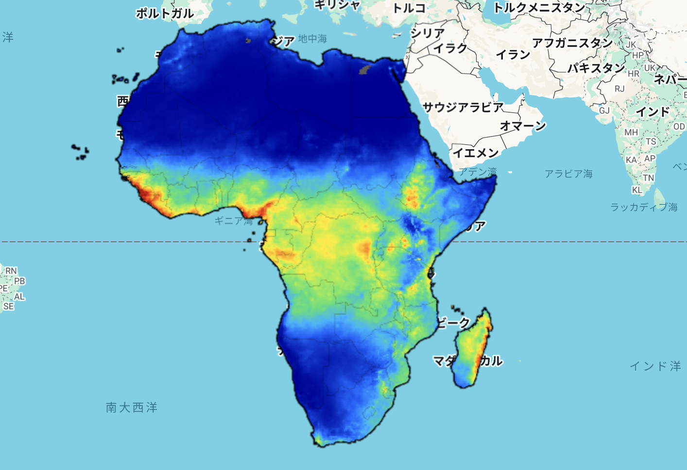
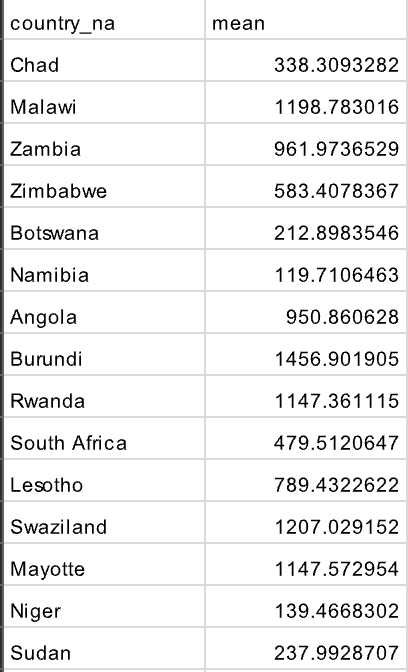

# Zonal Statistics – CHIRPS Annual Rainfall over Africa

This note summarizes the learning from Section 7: "Zonal Statistics" in the [Google Earth Engine Mega Course](https://www.udemy.com/course/google-earth-engine-gis-remote-sensing/learn/lecture/42661572#overview).

---

## What This Script Does

- Loads CHIRPS daily precipitation data (2023) for the African region
- Reduces 365 daily images into one image of annual total rainfall using `.reduce(ee.Reducer.sum())`
- Calculates mean annual rainfall for each country using `.reduceRegions()`
- Exports the resulting table as a CSV file to Google Drive
- Visualizes rainfall intensity across Africa using a color palette

---

## Key Concepts

| Concept                  | Description |
|--------------------------|-------------|
| `CHIRPS` dataset         | Global rainfall estimation from satellite + station data |
| `reduce()`               | Combines multiple images into one using a reducer function |
| `reduceRegions()`        | Applies a reducer (e.g. mean) to each feature (e.g. country polygon) |
| `scale: 5000`            | Spatial resolution (meters) used for computing zonal statistics |
| `Export.table.toDrive()` | Saves feature collection (CSV) to Google Drive |

---

## Output

### Annual Rainfall Map (CHIRPS 2023)

### CSV Output (Sample)

---

## Notes

### 1. What is CHIRPS Daily?

- CHIRPS stands for *Climate Hazards Center InfraRed Precipitation with Station data*.
- It is a high-resolution (0.05° ~5km) rainfall dataset that blends:
  - Infrared satellite estimates
  - Ground-based rain gauge observations
- Coverage: 1981–present
- Frequency: Daily
- Use cases:
  - Drought monitoring
  - Agricultural planning
  - Hydrology & water resource studies
  - Climate resilience and early warning systems
- Earth Engine Data Catalog
  - [CHIRPS Daily – Climate Hazards Center (UCSB)](https://developers.google.com/earth-engine/datasets/catalog/UCSB-CHG_CHIRPS_DAILY?hl=ja)

###  2. What does `.reduce(ee.Reducer.sum())` do?

- It sums all 365 daily images to compute **total annual rainfall**.
- Each image pixel represents rainfall (mm/day); the result is mm/year.

###  3. What does `.reduceRegions()` do?

- Applies a reducer (here: `.mean()`) over each **country polygon** to compute **average rainfall per country**.

### 4. What does `scale: 5000` mean?

- This defines the spatial resolution (in meters) at which zonal statistics are calculated.
- 5000m = 5km → roughly matches CHIRPS native resolution (~0.05°)
- Larger scale = faster but less precise; smaller scale = more accurate but slower.

---

## Reference

- **Udemy:** [GEE Mega Course – Section 7](https://www.udemy.com/course/google-earth-engine-gis-remote-sensing/learn/lecture/42661572)
- **Dataset:** [CHIRPS Daily – Climate Hazards Center (UCSB)](https://developers.google.com/earth-engine/datasets/catalog/UCSB-CHG_CHIRPS_DAILY?hl=ja)
- **Boundary Data:** [USDOS/LSIB_SIMPLE/2017 – Country Boundaries](https://developers.google.com/earth-engine/datasets/catalog/USDOS_LSIB_SIMPLE_2017)
