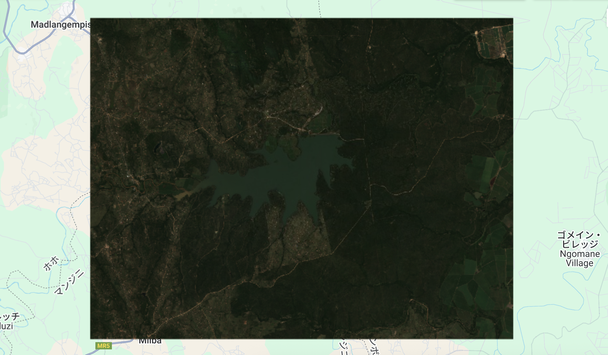
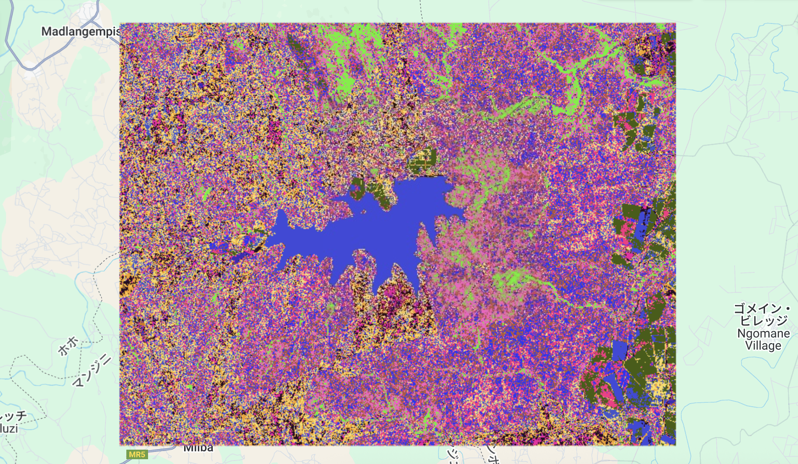

# Unsupervised Classification (K-means Clustering) – GEE Learning Log

This note summarizes the learning from Section 8: "Unsupervised Clustering Classification" in the [GEE Mega Course](https://www.udemy.com/course/google-earth-engine-gis-remote-sensing/learn/lecture/42661664#overview).

---

## What This Script Does

- Loads Sentinel-2 Surface Reflectance imagery over a region in South Africa
- Filters by date range and cloud coverage
- Rescales reflectance to float range (0–1)
- Samples 5,000 pixels from the image as a training dataset
- Trains a k-means clustering model with 15 clusters (unsupervised)
- Applies the trained model to classify land cover types
- Displays both the original image and classified clusters

---

## Key Concepts

| Concept                  | Description |
|--------------------------|-------------|
| `image.divide(10000)`    | Rescales reflectance from DN to 0–1 float values |
| `image.sample()`         | Randomly samples pixel values for training data |
| `scale: 30`              | Spatial resolution of sampling (30 meters) |
| `numPixels: 5000`        | Number of samples to extract |
| `ee.Clusterer.wekaKMeans()` | Trains a K-means clustering model |
| `image.cluster()`        | Applies trained model to image to classify each pixel |
| `randomVisualizer()`     | Displays classification result using random colors |

---

## Outputs

### True Color Composite (B4, B3, B2)


### K-means Classification Result (15 clusters)


---

## Notes

### 1. What does `min: 0, max: 0.4` in `visParam` mean?

These values define how pixel values are stretched for visualization.  
Reflectance values are usually scaled between 0–1, so setting `min: 0` and `max: 0.4` gives good contrast for true-color imagery.

### 2. What does `image.sample()` do?

This extracts training samples from the image:

- `region: roi` → within the area of interest
- `scale: 30` → sampling at 30m resolution (Sentinel-2 pixel size)
- `numPixels: 5000` → limits the number of sampled points to 5,000

Each sampled pixel includes values for bands B4, B3, B2.

#### 3. What do these steps do?

```javascript
var training = image.sample(...);
var clusterer = ee.Clusterer.wekaKMeans(15).train(training);
var result = image.cluster(clusterer);
```
- Step 1: Collect pixel samples from image (training set)
- Step 2: Train unsupervised K-means model using 15 clusters
- Step 3: Apply the model to classify each pixel in the image

The result is a classified map that groups similar pixel values into 15 categories, even without labeled data.

## Reference
- Udemy: [Google Earth Engine Mega Course – Section 8](https://www.udemy.com/course/google-earth-engine-gis-remote-sensing/learn/lecture/42661664#overview)
- Dataset: [COPERNICUS/S2_SR_HARMONIZED (Sentinel-2)](https://developers.google.com/earth-engine/datasets/catalog/COPERNICUS_S2_SR_HARMONIZED?hl=ja)
