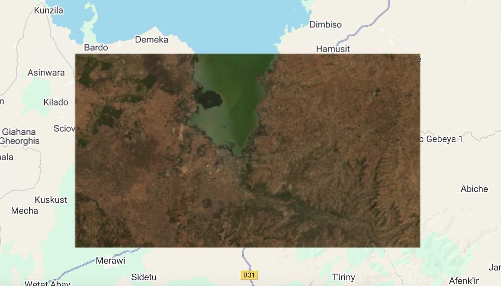
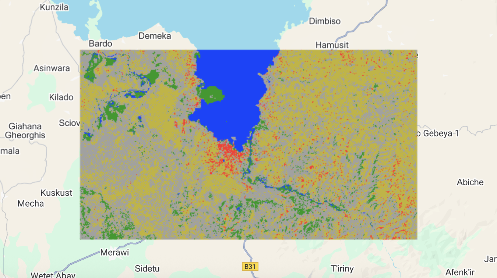

# Supervised Classification (Random Forest with Landsat 9) – GEE Learning Log

This note summarizes Section 8: "Random Forest Supervised Classification" of the [GEE Mega Course](https://www.udemy.com/course/google-earth-engine-gis-remote-sensing/learn/lecture/42661718).

---

## What This Script Does

- Loads Landsat 9 SR imagery and applies scaling
- Prepares labeled training points for 5 classes: water, urban, forest, crop, barren
- Trains a supervised Random Forest classifier (10 trees)
- Classifies all pixels into land cover types
- Assesses accuracy using a confusion matrix
- Exports classified map to Google Drive

---

## Key Concepts

| Concept                             | Description |
|-------------------------------------|-------------|
| `LANDSAT/LC09/C02/T1_L2`            | Landsat 9 Collection 2 Level-2 Surface Reflectance |
| `applyScaleFactors()`               | Converts DN values to reflectance and temperature |
| `randomColumn()`                    | Adds a random value to split data into train/test |
| `smileRandomForest(10)`            | Builds a 10-tree Random Forest classifier |
| `confusionMatrix.accuracy()`       | Calculates overall classification accuracy |
| `sampleRegions()`                  | Overlays training points to extract pixel values |

---

## Output

### Landsat RGB Composite


### Random Forest Classified Map


---

## Notes

### 1. Why use `LANDSAT/LC09/C02/T1_L2`?

This is **Landsat 9 Level-2 Surface Reflectance**, which:
- Is more recent and includes improved radiometric quality
- Suitable for precise classification tasks

### 2. When should I apply `applyScaleFactors()`?

Always apply when using reflectance values or running indices or machine learning.  
Otherwise the DN values (~0–10000) are not comparable.

### 3. What does this do?

```javascript
var water  = water.map(function(f) { return f.set('Class', 0); });
```
It assigns a numeric label (Class = 0) to each training feature in the water collection.
Other classes are labeled similarly (1–4).

#### 4. What does this block do?
```javascript
var trainingData = trainImage.randomColumn();
var trainSet = trainingData.filter(ee.Filter.lessThan("random", 0.8));
var testSet = trainingData.filter(ee.Filter.greaterThanOrEquals("random", 0.8));
```
- Adds a random number column (0–1) to split data
- trainSet: 80% of the samples for training
- testSet: 20% for validation

#### 6. What does this block do?

```javascript
var confusionMatrix = ee.ConfusionMatrix(testSet.classify(classifier)
  .errorMatrix({
    actual: "Class",
    predicted: "classification"
  }));

print("Confusion matrix;", confusionMatrix);
print("Overall Accuracy;", confusionMatrix.accuracy());
print("Producers Accuracy;", confusionMatrix.producersAccuracy());
print("Consumers Accuracy;", confusionMatrix.consumersAccuracy());
```
This block performs an accuracy assessment using a confusion matrix, based on the model's performance on the testSet.

- `ConfusionMatrix()` constructs a matrix comparing predicted vs actual classes.
- `accuracy()` calculates overall accuracy (total correct / total samples).
- `producersAccuracy()` measures recall: of the actual class, how many were correctly predicted.
- `consumersAccuracy()` measures precision: of the predicted class, how many were correct.

| Metric                  | Meaning                                 |
| ----------------------- | --------------------------------------- |
| **Overall Accuracy**    | % of all correctly predicted samples    |
| **Producer's Accuracy** | Recall: accuracy per actual class       |
| **Consumer's Accuracy** | Precision: accuracy per predicted class |

This is crucial for evaluating model performance before applying classification to new areas.

## Reference
- Udemy Course: [Google Earth Engine Mega Course – Section 8](https://www.udemy.com/course/google-earth-engine-gis-remote-sensing/learn/lecture/42661718#overview)

Datasets Used:
- [LANDSAT/LC09/C02/T1_L2 – Landsat 9 Surface Reflectance](https://developers.google.com/earth-engine/datasets/catalog/LANDSAT_LC09_C02_T1_L2)
- [USDOS/LSIB_SIMPLE/2017 – Country Boundaries](https://developers.google.com/earth-engine/datasets/catalog/USDOS_LSIB_SIMPLE_2017)
