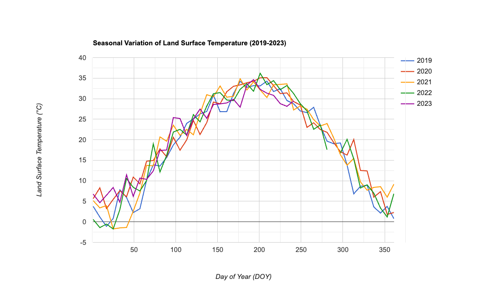

# LST Day-of-Year (DOY) Timeseries Plot – GEE Learning Log

This note summarizes Section 10: "LST DOY Timeseries Plot" from the [Google Earth Engine Mega Course](https://www.udemy.com/course/google-earth-engine-gis-remote-sensing/learn/lecture/42661810#overview).

---

## What This Script Does

- Loads MODIS MOD11A2 8-day Land Surface Temperature (LST) imagery
- Filters the image collection by region and date (2019–2023)
- Converts LST values from scaled Kelvin to degrees Celsius
- Creates a DOY-based time series plot using `ui.Chart.image.doySeriesByYear()`

---

## Key Concepts

| Concept                           | Description |
|-----------------------------------|-------------|
| `MODIS/061/MOD11A2`               | MODIS LST 8-day composite product |
| `.multiply(0.02).subtract(273.15)`| Converts raw MODIS values to Celsius |
| `.copyProperties()`               | Retains image date metadata |
| `ui.Chart.image.doySeriesByYear()`| Creates line plot of DOY vs. LST per year |
| `ee.Reducer.mean()`               | Averages LST over the selected region |
| `scale: 1000`                     | Spatial resolution in meters for charting |

---

## Output

The chart displays average daytime LST over the region across the years 2019–2023, plotted by **Day of Year (DOY)**.

### Sample Chart

## Notes

### 1. What is MODIS MOD11A2?

**MODIS** (Moderate Resolution Imaging Spectroradiometer) is a NASA satellite sensor onboard the Terra and Aqua satellites.

`MOD11A2` is the **Land Surface Temperature (LST) 8-day composite** product.

| Attribute              | Value                          |
|------------------------|--------------------------------|
| Temporal Resolution    | 8-day composite                |
| Spatial Resolution     | 1 kilometer                    |
| Unit (raw)             | Scaled Kelvin × 50             |
| Band used              | `LST_Day_1km` (daytime LST)    |
| Typical Use Cases      | Drought monitoring, heat waves, urban heat island analysis |

This dataset provides smoothed, cloud-filtered surface temperature estimates for global monitoring at moderate resolution.

---

### 2. What is `.copyProperties(img, [...])` doing?

This ensures each new image retains its original timestamp metadata (e.g. `system:time_start`).  
Without this, the chart cannot link data points to time correctly.

### 3. What is `ui.Chart.image.doySeriesByYear()`?

This function plots **average pixel values** by day-of-year across multiple years.  
It returns a line chart with DOY (1–366) on the x-axis and the averaged temperature on the y-axis.

### 4. What is `LST`?

Land Surface Temperature (LST) indicates the temperature of the Earth's surface, derived from thermal infrared sensors.  
The MODIS dataset reports LST in **Kelvin × 50**, hence the need for rescaling.

### 5. What does `.multiply(0.02).subtract(273.15)` mean?

MODIS LST values are stored as integers and need conversion:
- Multiply by 0.02 → converts to Kelvin
- Subtract 273.15 → converts to degrees Celsius

### 6. What does `ee.Reducer.mean()` do?

It computes the **average LST** over all pixels in the region of interest for each DOY.

### 7. What is `scale: 1000`?

This tells GEE to aggregate pixel values using 1-kilometer resolution.  
It matches the native resolution of MODIS LST data.

---

## Reference

- **Udemy**:  
  [Google Earth Engine Mega Course – Section 9](https://www.udemy.com/course/google-earth-engine-gis-remote-sensing/learn/lecture/42661810#overview)

- **Dataset**:  
  [MODIS/061/MOD11A2 – Land Surface Temperature and Emissivity (8-day, 1km)](https://developers.google.com/earth-engine/datasets/catalog/MODIS_061_MOD11A2)
