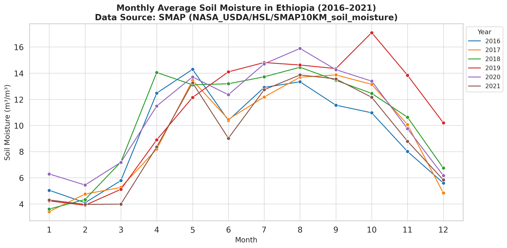

# SMAP Monthly Soil Moisture Aggregation – GEE Learning Log

This note summarizes Section 9: "Soil Moisture Analysis" of the [Google Earth Engine Mega Course](https://www.udemy.com/course/google-earth-engine-gis-remote-sensing/learn/lecture/42661904#overview).

---

## What This Script Does

- Loads SMAP satellite data for surface soil moisture (2016–2021)
- Filters by Ethiopia using ROI
- Aggregates daily SMAP images into monthly averages
- Exports results as a CSV table containing: year, month, mean soil moisture

---

## Key Concepts

| Concept                       | Description |
|-------------------------------|-------------|
| `NASA_USDA/HSL/SMAP10KM_soil_moisture` | SMAP 10km Surface Soil Moisture |
| `.set()`                      | Adds metadata to each image (e.g. month, year) |
| `.reduceRegions()`            | Calculates zonal mean for each image by polygon |
| `.fromImages()`               | Constructs new collection from nested loops |
| `Export.table.toDrive()`      | Writes results to Google Drive in CSV format |

---

## Output

The chart and CSV contain monthly soil moisture estimates across Ethiopia from 2016–2021.

### Sample Output


Figure. Monthly average soil moisture in Ethiopia from 2016 to 2021.<br>
Data source: NASA/USDA SMAP 10km soil moisture dataset (`NASA_USDA/HSL/SMAP10KM_soil_moisture`)

---

## Notes

### 1. What is SMAP?

**SMAP** (Soil Moisture Active Passive) is a NASA mission for measuring surface soil moisture.

| Property              | Value                       |
|-----------------------|-----------------------------|
| Dataset               | `NASA_USDA/HSL/SMAP10KM_soil_moisture` |
| Variable              | `ssm` = surface soil moisture |
| Resolution            | 10 km                       |
| Temporal Coverage     | Daily                       |
| Use Cases             | Agriculture, drought, hydrology, flood risk |

---

### 2. What does this block do?

```javascript
var smap = coll.map(function(img){
  var d = ee.Date(ee.Number(img.get("system:time_start")));
  var m = ee.Number(d.get("month"));
  var y = ee.Number(d.get("year"));
  return img.set({"month": m, "year": y});
});
```

It extracts month and year from the timestamp of each image and stores them as metadata.
These values are later used to group images by month for averaging.

### 3. What is `fromImages(years.map(...months.map(...)))` doing?
This block creates a new ImageCollection with one averaged image per month and year.
It loops over every (year, month) combination and filters+averages the matching images.

### 4. What does this block do?
```javascript
var smapEthiopia = byYearMonth.map(function(img){
  var features = roi.map(function(f){
    return f.set("date", img.get("date"), "month", img.get("month"), "year", img.get("year"));
  });
  return img.reduceRegions(features, ee.Reducer.mean(), 1000);
});
```
- Adds metadata to each polygon (date/month/year)
- Then computes the mean soil moisture within each polygon using `.reduceRegions()`
- The 1000 is the spatial resolution in meters

Reference
- Udemy:
[GEE Mega Course – Section 9: Drought Monitoring](https://www.udemy.com/course/google-earth-engine-gis-remote-sensing/learn/lecture/42661904#overview)

- Datasets:
  - [NASA_USDA/HSL/SMAP10KM_soil_moisture (EE Catalog)](https://developers.google.com/earth-engine/datasets/catalog/NASA_USDA_HSL_SMAP10KM_soil_moisture)
  - [USDOS/LSIB_SIMPLE/2017 – Country Boundaries](https://developers.google.com/earth-engine/datasets/catalog/USDOS_LSIB_SIMPLE_2017?hl=ja)
