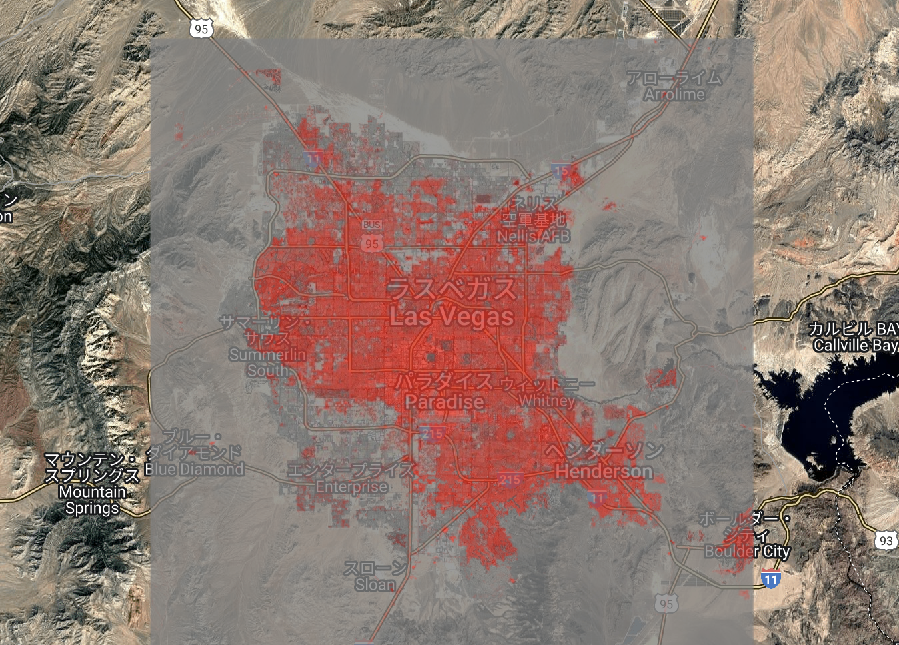

# NLCD Impervious Surface (2001, Las Vegas) – GEE Learning Log

This note summarizes Section 10: Urban Mapping "NLCD Impervious Surface" of the [Google Earth Engine Mega Course](https://www.udemy.com/course/google-earth-engine-gis-remote-sensing/learn/lecture/42677790#overview).

---

## What This Script Does

- Loads the USGS NLCD impervious dataset
- Filters the dataset to the year 2001
- Extracts the "impervious surface" band
- Clips it to the Las Vegas region of interest
- Visualizes and exports the image to Google Drive

---

## Key Concepts

| Concept                         | Description |
|---------------------------------|-------------|
| `USGS/NLCD_RELEASES/...`        | National Land Cover Database (NLCD), US-only |
| `system:index`                  | Used to identify image year (e.g. "2001", "2016") |
| `.aggregate_array()`            | Lists all values of a specified metadata property |
| `impervious`                    | % of land that is paved or covered (0–100%) |
| `Export.image.toDrive()`        | Saves map as PNG or GeoTIFF to your Drive |

---

## Output

The map shows **impervious surfaces** (urbanized or paved areas) in Las Vegas in **2001**.


---

## Notes

### What is NLCD?

NLCD = National Land Cover Database  
Produced by USGS, covers the United States, includes land cover classes, tree canopy, impervious surface, etc.  
Updated every 2–5 years.

### What does `.aggregate_array("system:index")` do?

This returns a list of all unique values for the `"system:index"` property in the ImageCollection.  
Useful to inspect available **years** or identifiers before filtering.

Example result:
```javascript
["2001", "2004", "2006", "2008", "2011", "2013", "2016", "2019"]
```

### What is "impervious"?
"Impervious" surfaces are man-made areas that do not absorb water — e.g., roads, buildings, parking lots.
Values range from 0 (fully pervious) to 100 (fully impervious).
Useful for urban growth analysis, flood risk, surface runoff modeling.

## Reference
- Udemy:
[GEE Mega Course – Section 10: Urban Mapping](https://www.udemy.com/course/google-earth-engine-gis-remote-sensing/learn/lecture/42677790#overview)

- Dataset:
[USGS/NLCD_RELEASES/2019_REL/NLCD](https://developers.google.com/earth-engine/datasets/catalog/USGS_NLCD_RELEASES_2019_REL_NLCD)
