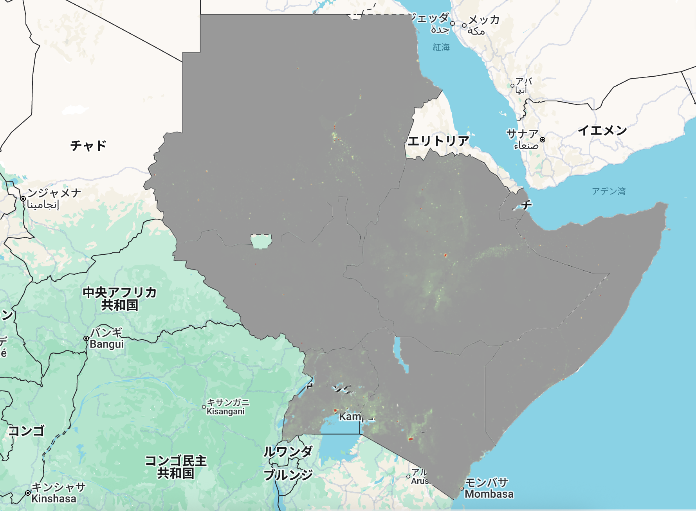

# WorldPop Population (Mean)  – GEE Learning Log

This note summarizes the workflow from Section 10: "Worldpop Population" in the [GEE Mega Course](https://www.udemy.com/course/google-earth-engine-gis-remote-sensing/learn/lecture/42677794#overview).

---

## What This Script Does

- Loads unadjusted population data from the WorldPop dataset
- Extracts population data over 7 countries in the Horn of Africa
- Computes pixel-wise average population
- Displays the result with a custom color palette

---

## Key Concepts

| Concept                     | Description |
|-----------------------------|-------------|
| `WorldPop/POP`              | Unadjusted population count per 100m grid |
| `.reduce(ee.Reducer.mean())`| Computes mean population per pixel across years |
| `inList()`                  | Filters features by list of country names |
| `.clip()`                   | Restricts image to the defined region |

---

## Output

Visual map of **average population** (per 100m × 100m pixel) across multiple years in the Horn of Africa.

---

## Notes

### What is the WorldPop dataset?

WorldPop is a global gridded population dataset provided by [WorldPop.org](https://www.worldpop.org).  
It shows the estimated number of people living in each 100m × 100m pixel.

- Resolution: 100 meters (0.0009 degrees)
- Year: **2020 only** (as of current Earth Engine dataset version)
- Units: People per pixel (unadjusted population count)
- Applications: risk mapping, urban planning, health modeling, humanitarian response

---

### What does `worldpop.reduce(ee.Reducer.mean())` do?

In this script, the reducer is applied **across space**, not time — because there’s only one image (2020).  
It calculates the **mean population per pixel** by spatially averaging across all layers in the image collection (effectively just one).

## Reference
**Udemy:**
- [GEE Mega Course – Section 10: Urban Mapping -WorldPop Population](https://www.udemy.com/course/google-earth-engine-gis-remote-sensing/learn/lecture/42677794#overview)

**Dataset:**
- WorldPop Population
  - Collection ID: WorldPop/POP
  - Source: Earth Egine Data Catalog | [WorldPop Global Project Population Data: Constrained Estimated Age and Sex Structures of Residential Population per 100x100m Grid Square](https://developers.google.com/earth-engine/datasets/catalog/WorldPop_GP_100m_pop_age_sex_cons_unadj?hl=ja#description)

- Administrative Boundaries
  - Collection ID: USDOS/LSIB_SIMPLE/2017
  - Source: Earth Egine Data Catalog |  [LSIB 2017: Large Scale International Boundary Polygons, Simplified](https://developers.google.com/earth-engine/datasets/catalog/USDOS_LSIB_SIMPLE_2017?hl=ja)
