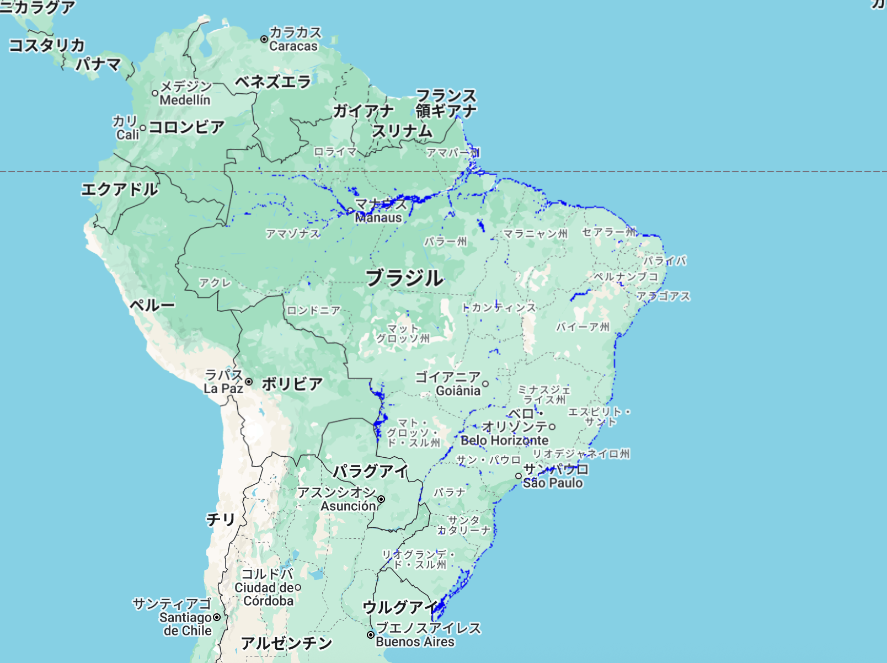

# National Water Map – GEE Learning Log

This log summarizes the workflow learned from Section 11: "National Water Map" in the [Google Earth Engine Mega Course](https://www.udemy.com/course/google-earth-engine-gis-remote-sensing/learn/lecture/42953798).

---

## What This Script Does

- Loads **JRC Global Surface Water** (`GSW1_4`) dataset
- Filters and selects the `max_extent` band to show all water ever detected (1984–2021)
- Clips the result to a specific country boundary (Brazil)
- Uses `.selfMask()` to display water pixels only
- Visualizes water extent over Brazil in blue

---

## Key Concepts

| Concept             | Description |
|---------------------|-------------|
| `max_extent`        | Water was detected at least once from 1984–2021 |
| `.clip()`           | Restricts display to Brazil only |
| `.selfMask()`       | Keeps pixels with value = 1 (water), hides land pixels (0) |
| `Map.addLayer()`    | Displays binary water mask on the map |

---

## Output

The map displays the **total surface water extent** in Brazil based on the full historical range (1984–2021).  
This is useful for identifying permanent or intermittent water bodies.

### Output Example


---

## Notes

### What is the Global Surface Water dataset?

- Dataset ID: `JRC/GSW1_4/GlobalSurfaceWater`
- Years covered: 1984–2021
- Spatial resolution: 30 meters
- Bands include:
  - `occurrence`, `seasonality`, `change`, `max_extent`, etc.
- This script uses `max_extent` to visualize **all pixels that were water at any time**.

### What does `.selfMask()` do?

`.selfMask()` hides all pixels with a value of 0 (land), and keeps only those with value 1 (water).  
This is a convenient way to create **binary masks** for visualization.

Equivalent to:
```javascript
image.updateMask(image)
```
---

## Reference

- Udemy:
  [GEE Mega Course – Section 11: National Water Map](https://www.udemy.com/course/google-earth-engine-gis-remote-sensing/learn/lecture/42953798)

- GEE Dataset:
  - [JRC GSW v1.4 – Global Surface Water](https://developers.google.com/earth-engine/datasets/catalog/JRC_GSW1_4_GlobalSurfaceWater#description)
  - [LSIB 2017: Large Scale International Boundary Polygons, Simplified](https://developers.google.com/earth-engine/datasets/catalog/USDOS_LSIB_SIMPLE_2017?hl=ja)
