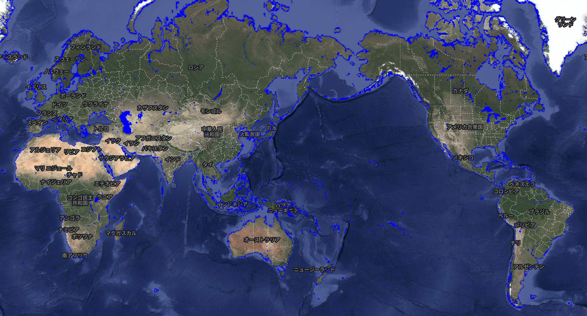
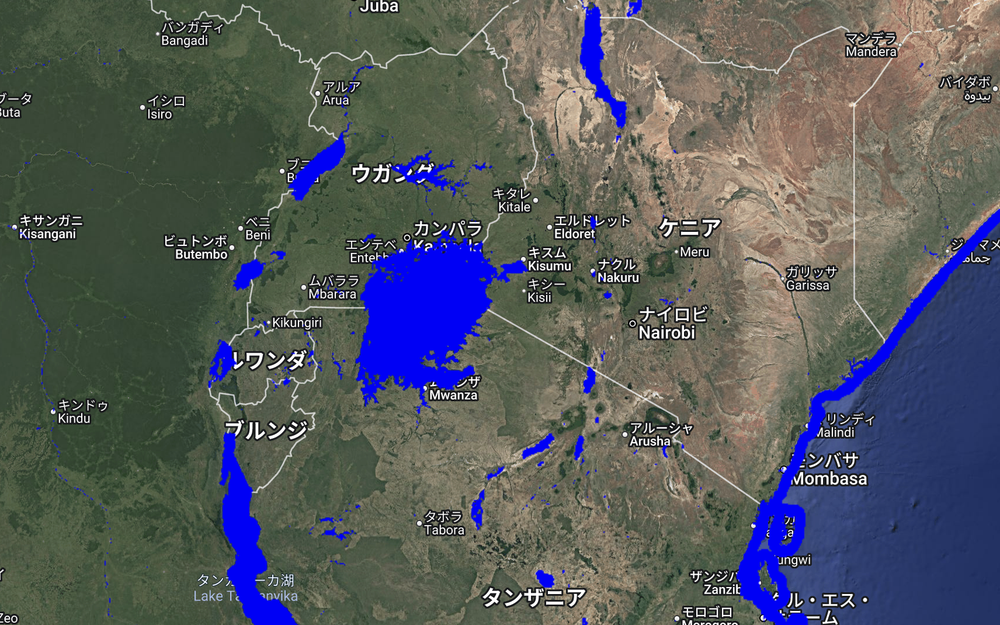

# Global Surface Water Mask (max_extent) – GEE Learning Log

This document summarizes key concepts from Section 11 ("Water Mask") of the [GEE Mega Course](https://www.udemy.com/course/google-earth-engine-gis-remote-sensing/learn/lecture/42677814#overview), focusing on water masking techniques using the JRC Global Surface Water dataset.

---

## What This Script Does

- Loads the `max_extent` band from JRC Global Surface Water dataset
- Generates a binary mask identifying areas ever detected as water (1984–2021)
- Implements two masking approaches to display only water areas:
　　- `updateMask()` method
　　- `selfMask()` method
- Visualizes global surface water extent in blue

---

## Core Concepts

### Dataset Information
| Property | Description |
|----------|-------------|
| Dataset | `JRC/GSW1_4/GlobalSurfaceWater` |
| Source | Landsat-derived global water data (v1.4) |
| Time Period | 1984-2021 |
| Key Band | `max_extent` (1=water ever detected, 0=never water) |

### Masking Methods
| Method | Description | Equivalent Code |
|--------|-------------|-----------------|
| `updateMask(image)` | Preserves pixels meeting specified conditions | - |
| `selfMask()` | Automatically masks zero-value pixels | `image.updateMask(image)` |
---

## Output Examples
Shows all pixels ever classified as water (value=1) in blue.

### Sample Visualizations
- **Global Distribution**  
  
- **Lake Victoria Region**  
  

---

## Technical Notes

### About JRC Global Surface Water Dataset
Comprehensive water dynamics dataset including:

- `occurrence`: Water detection frequency
- `seasonality`: Seasonal patterns
- `change`: Water gain/loss trends
- `max_extent`: Binary water presence indicator

[Dataset Details](https://developers.google.com/earth-engine/datasets/catalog/JRC_GSW1_4_GlobalSurfaceWater)

### Water Mask Fundamentals
- Binary classification layer distinguishing water bodies
- Uses `max_extent` to identify historically persistent water areas

### Method Comparison
- **`updateMask(water)`**  
  Explicit conditional masking
- **`selfMask()`**  
  Automatic zero-value filtering (optimized for binary data)

---

## References
1. [GEE Mega Course - Water Mask Section](https://www.udemy.com/course/google-earth-engine-gis-remote-sensing/learn/lecture/42677814#overview)
2. [Earth Engine Data Catalog - JRC GSW v1.4 Documentation](https://developers.google.com/earth-engine/datasets/catalog/JRC_GSW1_4_GlobalSurfaceWater#bands)
