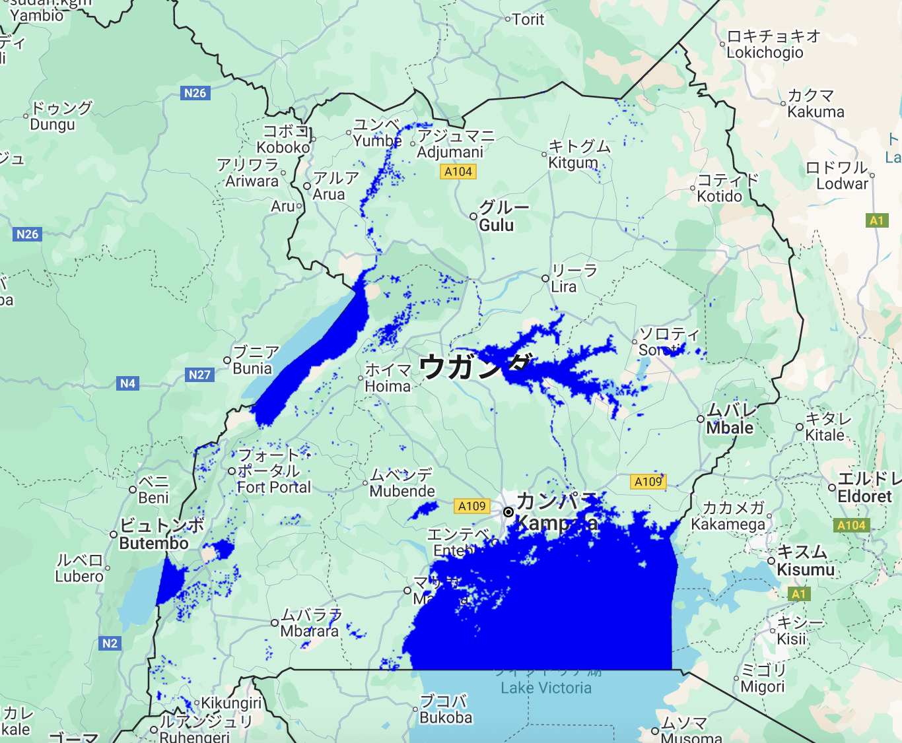

# Water Prediction with Sentinel-2 and Random Forest Classifier – GEE Learning Log

This log summarizes the workflow learned from Section 11: "Water Prediction with Sentinel" in the [GEE Mega Course](https://www.udemy.com/course/google-earth-engine-gis-remote-sensing/learn/lecture/42953808).

---

## What This Script Does

- Loads Sentinel-2 imagery
- Computes NDVI and adds it as a band
- Merges manually labeled water / non-water points
- Trains a Random Forest classifier to predict water areas
- Visualizes and exports the classification result
- Evaluates accuracy using a confusion matrix

---

## Key Concepts

| Concept | Description |
|--------|-------------|
| `normalizedDifference()` | Computes NDVI (B8 - B4) / (B8 + B4) |
| `sampleRegions()` | Extracts pixel values at training point locations |
| `randomColumn()` | Randomly assigns data for splitting training/test sets |
| `smileRandomForest` | GEE's Random Forest classifier from Smile library |
| `updateMask()` | Masks out non-water pixels for display |
| `ConfusionMatrix` | Evaluates model accuracy using test set |

---

## Output

A binary classification of water (1) vs non-water (0) over Uganda, using Sentinel-2 features and trained labels. Water is visualized in blue.

### Example Output

---

## Notes

### What is being classified?
The classifier is trained on pixel values for bands B2, B3, B4, B8 and NDVI, using manually labeled water (Class 1) and non-water (Class 0) points.

### What does the confusion matrix show?
- **Overall accuracy**: How many total predictions were correct
- **Producer's accuracy**: Recall; how many actual water pixels were correctly predicted
- **Consumer's accuracy**: Precision; how many predicted water pixels were actually water

> No universal benchmark exists, but 80–90% overall accuracy is often considered good.

### How many training points are enough?
Depends on landscape complexity, but ~200–500 points per class is often used for regional models.

---

## Reference

- **Udemy**: [GEE Mega Course – Section 11: Water Prediction with Sentinel](https://www.udemy.com/course/google-earth-engine-gis-remote-sensing/learn/lecture/42953808)
- **GEE Datasets**:
  - [COPERNICUS/S2_HARMONIZED](https://developers.google.com/earth-engine/datasets/catalog/COPERNICUS_S2_HARMONIZED)
  - [USDOS/LSIB_SIMPLE/2017](https://developers.google.com/earth-engine/datasets/catalog/USDOS_LSIB_SIMPLE_2017)
