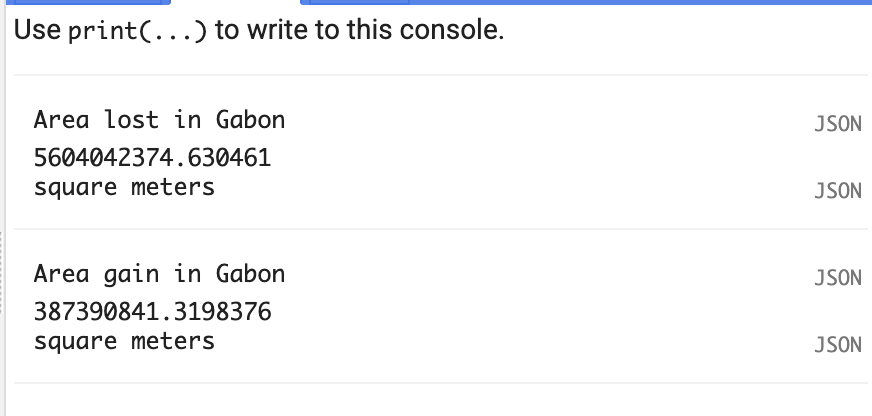
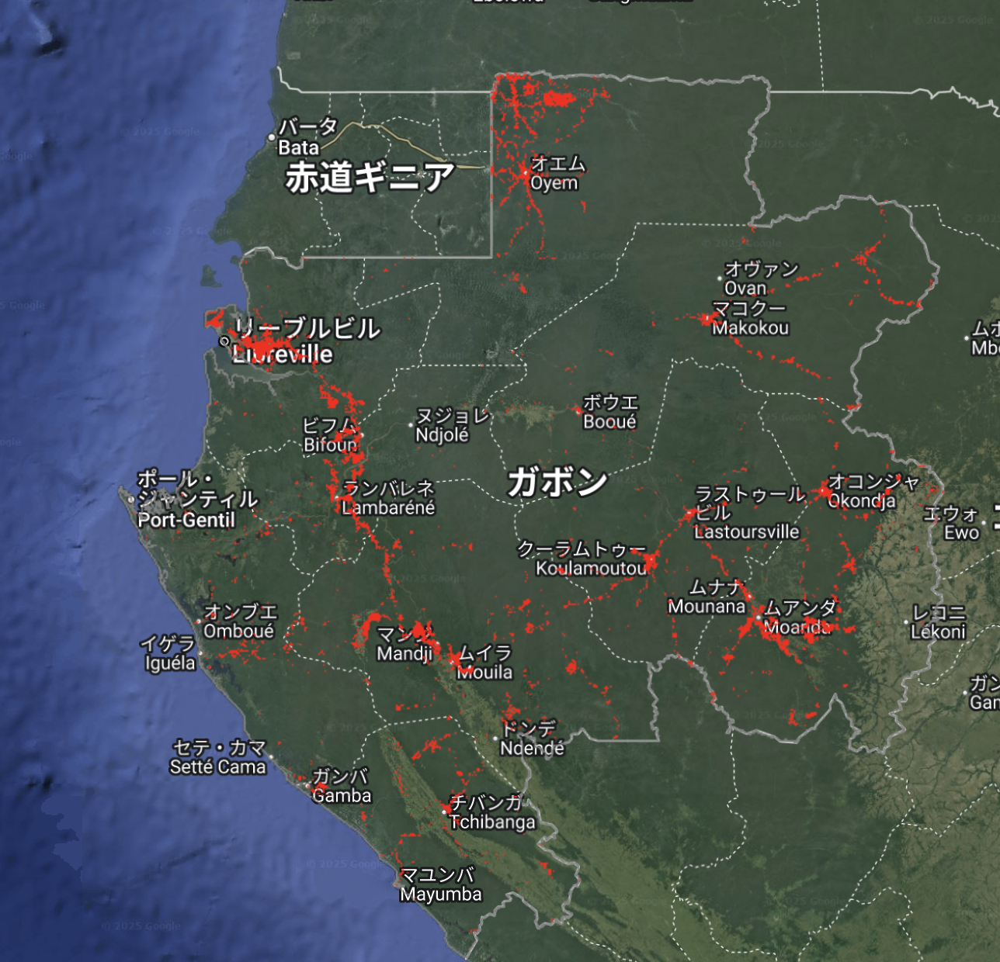
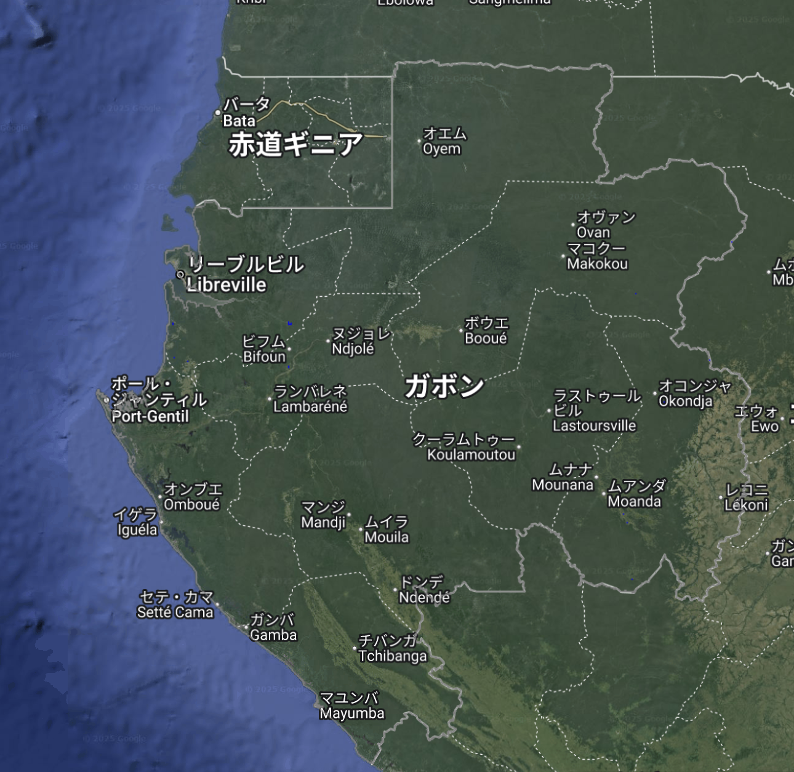
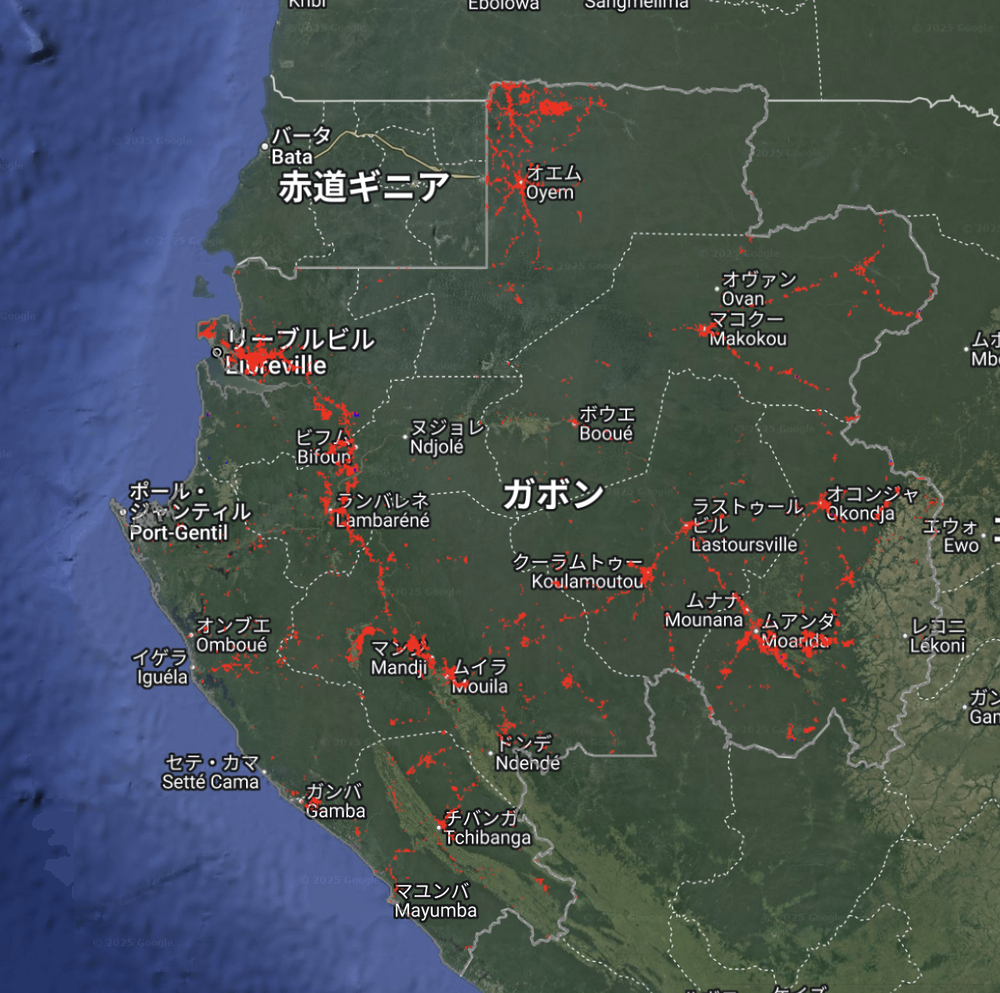

# Forest Gain and Loss Area Statistics – GEE Learning Log

This note summarizes the learning from Section 12 of the [Google Earth Engine Mega Course](https://www.udemy.com/course/google-earth-engine-gis-remote-sensing/learn/lecture/43096418).

---

## What This Script Does

- Loads the **Hansen Global Forest Change v1.12** dataset
- Filters the region to **Gabon**
- Extracts and visualizes:
  - **Forest Loss** (2001–2024)
  - **Forest Gain** (2000–2012)
- Calculates the total loss and gain areas (square meters)
- Adds Gabon boundary overlay

---

## Key Concepts

| Concept | Description |
|--------|-------------|
| `loss` | Binary layer (1 = tree loss between 2001–2024) |
| `gain` | Binary layer (1 = tree gain between 2000–2012) |
| `updateMask()` | Masks pixels where value ≠ 1, keeps only valid forest change |
| `ee.Image.pixelArea()` | Returns the area (in m²) of each pixel |
| `multiply()` | Applies pixel-wise multiplication to compute per-pixel area |
| `reduceRegion()` | Summarizes raster data over a region using a reducer|
| `ee.Reducer.sum()` | Calculates the total sum of pixel values in a region |
| `geometry` | Extracts the geometry (shape) of the region of interest (ROI) |
| `scale: 30` | Uses 30m resolution for analysis (Landsat scale) |

---

## Output

### Sample Area Outputs:

- **Total Forest Loss**: `5604.04 km²`
- **Total Forest Gain**: `387.39 km²`

---

## Output Samples

- **Forest Loss Map (2001–2024)**  
  Pixels in red represent tree cover loss during the period  
  

- **Forest Gain Map (2000–2012)**  
  Pixels in blue represent areas where tree cover increased  
  

- **Combined Gain & Loss Map**  
  Shows both gain (blue) and loss (red) areas across Gabon  
  

---

## Notes
### Dataset Description: Hansen Global Forest Change v1.12
- Dataset: UMD/hansen/global_forest_change_2024_v1_12
- Time Span: 2000–2024
- Resolution: 30m
- Loss Band: Pixel = 1 if tree cover loss occurred in any year
- Gain Band: Pixel = 1 if forest growth occurred between 2000 and 2012

### What is `ee.Image.pixelArea()`?
This function returns the area (in square meters) for each pixel.
When multiplied with a binary mask (like loss or gain), it gives the total area of change.

### Why use `.multiply(pixelArea)`?
This converts a binary mask (e.g. 1 for loss) into an area raster. When summed, it gives the total area affected.

### What is `reduceRegion()` doing?
It summarizes pixel values across a specified region using a reducer. In this case:
- `ee.Reducer.sum()` calculates the total sum of changed pixel areas.
- `geometry`: roi.geometry() specifies the area of Gabon.
- `scale: 30` uses Landsat resolution (30 meters).

### What does `.updateMask()` do?
It hides all pixels except where loss == 1. This helps visualize only valid change areas.

---

## Reference
1. [Google Earth Engine Mega Course – Section 12](https://www.udemy.com/course/google-earth-engine-gis-remote-sensing/learn/lecture/43096418)
2. [Global Forest Extent：UMD/hansen/global_forest_change_2024_v1_12](https://developers.google.com/earth-engine/datasets/catalog/UMD_hansen_global_forest_change_2024_v1_12)
3. [World administrative boundaries：USDOS/LSIB_SIMPLE/2017](https://developers.google.com/earth-engine/datasets/catalog/USDOS_LSIB_SIMPLE_2017?hl=ja)
