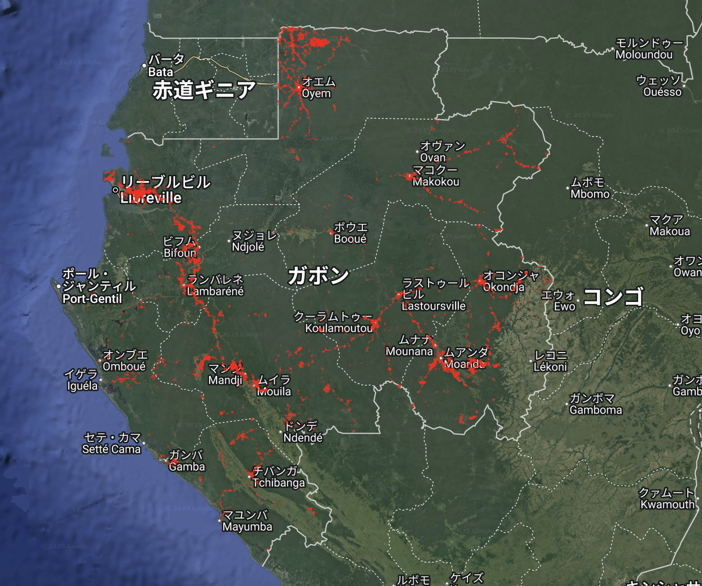
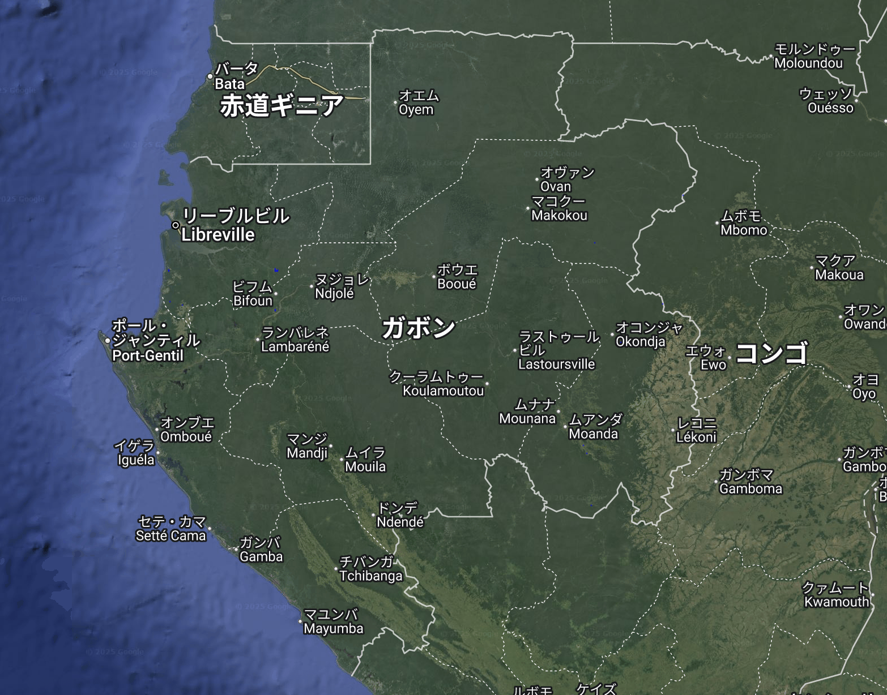
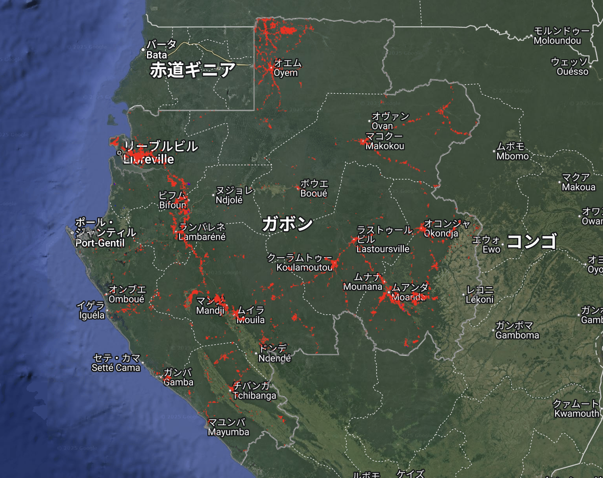

# Forest Gain and Loss Mapping – GEE Learning Log

This note summarizes the learning from Section 12 of the [Google Earth Engine Mega Course](https://www.udemy.com/course/google-earth-engine-gis-remote-sensing/learn/lecture/43096400#overview).

---

## What This Script Does

- Loads the **Hansen Global Forest Change v1.12** dataset
- Filters the region to **Gabon**
- Extracts and visualizes:
  - **Forest Loss** (2000–2024, in red)
  - **Forest Gain** (2000–2012, in blue)
- Adds Gabon boundary overlay

---

## Key Concepts

| Concept | Description |
|--------|-------------|
| `loss` | Binary layer (1 = tree loss between 2000–2024) |
| `gain` | Binary layer (1 = tree gain between 2000–2012) |
| `updateMask()` | Masks pixels where value ≠ 1, keeps only valid forest change |
| `paint()` | Draws country boundary as a vector overlay |

---

## Output Samples
### 1. Forest Loss in Gabon (2000–2024)
This map highlights areas in Gabon that experienced forest cover loss between 2000 and 2024 using the Hansen Global Forest Change dataset v1.12.
Only pixels with loss = 1 are shown in red, indicating complete removal of tree canopy.

### 2. Forest Gain in Gabon (2000–2012)
This map shows areas of forest gain (regrowth) in Gabon, based on Hansen dataset’s gain band.
The gain represents areas where new forest growth occurred between 2000 and 2012. Highlighted in blue.

### 3. Forest Change Map – Gain and Loss in Gabon
A combined map showing both forest loss (red) from 2000–2024 and gain (blue) from 2000–2012 in Gabon.
Useful for comparing deforestation and regrowth areas in one view using Hansen Global Forest Change v1.12 data.

---

## Notes

### What is the Hansen Global Forest Change Dataset?
- **Dataset**: `UMD/hansen/global_forest_change_2024_v1_12`
- **Temporal Range**: 2000–2024
- **Resolution**: 30m (Landsat-based)
- **Key Bands**:
  - `treecover2000`: Canopy cover % in 2000
  - `loss`: Tree cover loss (year encoded in `lossyear`)
  - `gain`: Areas where forest grew between 2000–2012 (static binary layer)

### What does `.updateMask(loss)` or `.updateMask(gain)` do?
- Filters the image so only pixels with value = 1 are visible (i.e., forest lost or gained)
- Without this, the entire image (including 0 values) would be shown with unwanted background

### What is the difference between gain and loss?
| Band | Description |
|------|-------------|
| `loss` | Tree cover removed between 2000 and 2024 |
| `gain` | Forest regrowth between 2000 and 2012 (only fixed period) |

---

## Reference

1. [Google Earth Engine Mega Course – Section 12](https://www.udemy.com/course/google-earth-engine-gis-remote-sensing/learn/lecture/43096400)
2. Global Forest Extent：[UMD/hansen/global_forest_change_2024_v1_12](https://developers.google.com/earth-engine/datasets/catalog/UMD_hansen_global_forest_change_2024_v1_12?hl=en)
3. World administrative boundaries：[USDOS/LSIB_SIMPLE/2017](https://developers.google.com/earth-engine/datasets/catalog/USDOS_LSIB_SIMPLE_2017?hl=ja)
