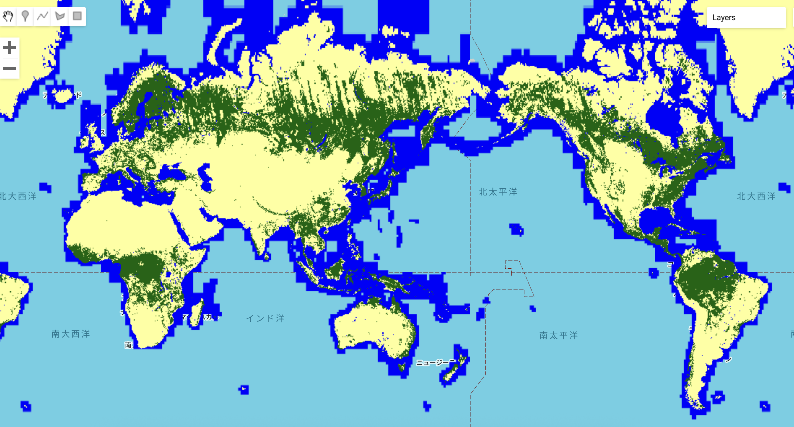

# Global Forest Cover – GEE Learning Log

This note summarizes the exercise from Section 12: "Global Forest Cover" in the [GEE Mega Course](https://www.udemy.com/course/google-earth-engine-gis-remote-sensing/learn/lecture/42968312#overview).

---

## What This Script Does

- Loads the **JAXA ALOS/PALSAR Global Forest/Non-Forest Map** for 2017
- Visualizes forest, non-forest, and water areas with a 3-color palette
- Useful for global forest cover assessment

---

## Key Concepts

| Concept             | Description                                                                 |
|---------------------|-----------------------------------------------------------------------------|
| `ee.ImageCollection` | Loads multi-temporal remote sensing products                               |
| `filterDate()`       | Selects a specific year (2017)                                              |
| `select("fnf")`      | Chooses the Forest/Non-Forest classification band                          |
| `Map.addLayer()`     | Visualizes forested and non-forested areas                                 |

---

## Output

Global Map

Map of Amazon Region

---

## Notes

### What is the ALOS/PALSAR Global Forest/Non-Forest Dataset?

- **Name**: Global 3-class PALSAR-2/PALSAR Forest/Non-Forest Map
- **Provider**: Japan Aerospace Exploration Agency (JAXA)
- **Resolution**: 25 meters
- **Temporal Coverage**: Annual (2007, 2010, 2015–2020)
- **Classes**:
  - `1`: Forest
  - `2`: Non-Forest
  - `3`: Water
- **Use cases**: Deforestation monitoring, land cover change, conservation planning

More info:  
[ALOS/PALSAR Dataset Description (Google Earth Engine)](https://developers.google.com/earth-engine/datasets/catalog/JAXA_ALOS_PALSAR_YEARLY_FNF)

---

## Reference

- **Udemy**: [GEE Mega Course – Global Forest Cover](https://www.udemy.com/course/google-earth-engine-gis-remote-sensing/learn/lecture/42968312#overview)
- **GEE Dataset**: [JAXA/ALOS/PALSAR/YEARLY/FNF](https://developers.google.com/earth-engine/datasets/catalog/JAXA_ALOS_PALSAR_YEARLY_FNF)
