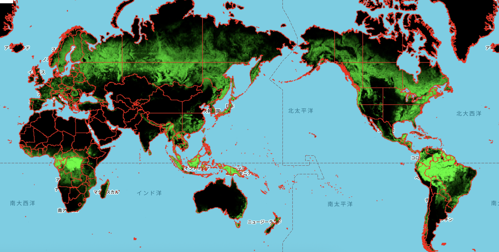
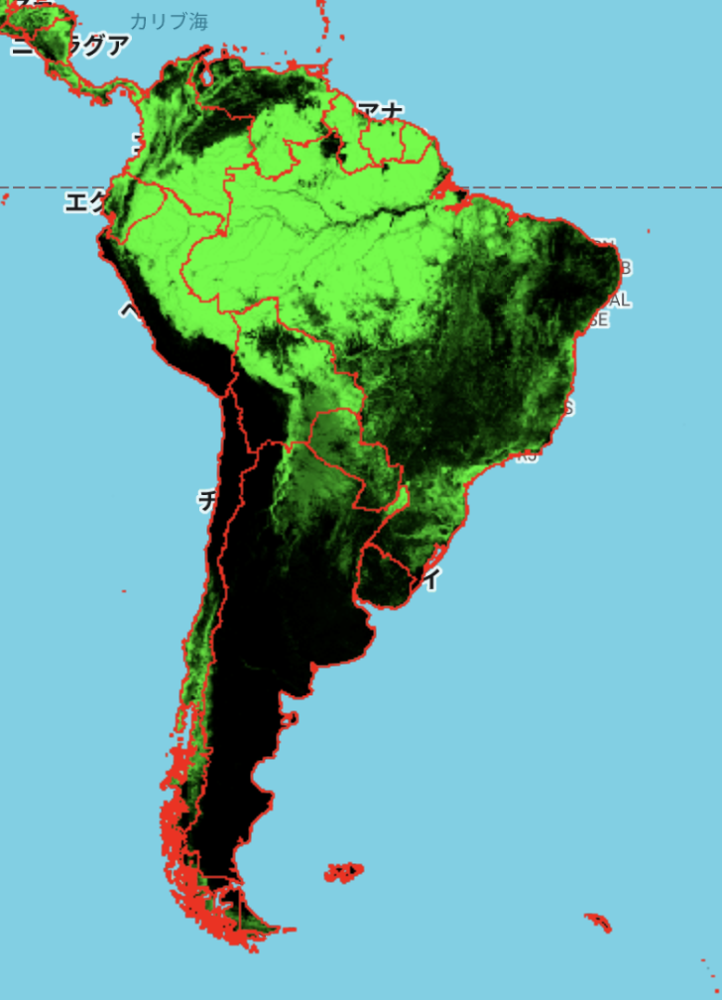
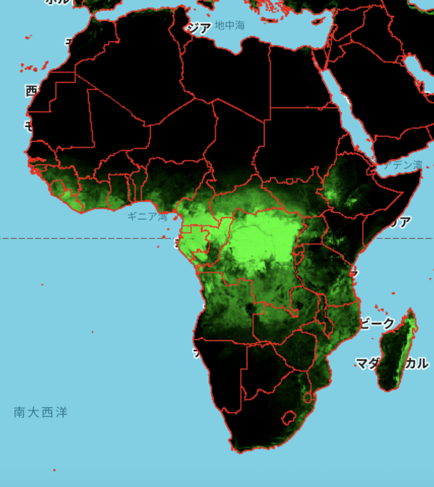

# Global Tree Cover (2000) – GEE Learning Log

This note summarizes the content from Section 12: "Global Tree Cover" in the [GEE Mega Course](https://www.udemy.com/course/google-earth-engine-gis-remote-sensing/learn/lecture/42984302#overview).

---

## What This Script Does

- Loads the **Hansen Global Forest Change v1.12** dataset
- Visualizes **tree cover percentage for the year 2000**
- Overlays global country boundaries
- Produces visual outputs

---

## Key Concepts

| Concept                     | Description                                                              |
|-----------------------------|--------------------------------------------------------------------------|
| `UMD/hansen/global_forest_change_2024_v1_12` | Forest change and tree cover dataset from UMD and Hansen team     |
| `treecover2000`             | Pixel-wise tree cover percentage (0–100%) in the year 2000               |
| `.paint()`                  | Renders country boundaries as vector outlines                            |
| `.clip()`                   | Restricts tree cover data to country boundaries                          |

---

## Output Samples

### Global View

### South America

### Africa

---

## Notes

### What is the Hansen Global Forest Change dataset?

- **Provider**: University of Maryland / Hansen Lab
- **Name**: Global Forest Change v1.12 (2000–2024)
- **Resolution**: 30 meters
- **Temporal Coverage**: Annual (2000 to 2024)
- **Key Band Used**:
  - `treecover2000`: Tree canopy cover percentage per pixel in 2000 (0–100%)
- **Use Cases**: Deforestation tracking, forest policy, conservation

More: [Dataset documentation](https://developers.google.com/earth-engine/datasets/catalog/UMD_hansen_global_forest_change_2024_v1_12)

---

### What is the difference from the ALOS/PALSAR FNF map?

| Feature                    | Hansen GFC                            | ALOS/PALSAR FNF                          |
|---------------------------|----------------------------------------|------------------------------------------|
| Classification            | Tree cover % (continuous: 0–100%)      | 3-class (Forest, Non-Forest, Water)      |
| Resolution                | 30m                                    | 25m                                      |
| Sensor                    | Landsat-based                          | L-band radar (PALSAR)                    |
| Use case                  | Detecting gradual change in canopy     | Coarse classification of forest extent   |
| Global Consistency        | Annual and long-term time series       | Yearly snapshots for selected years      |

---

## References

1. [GEE Mega Course – Global Tree Cover](https://www.udemy.com/course/google-earth-engine-gis-remote-sensing/learn/lecture/42984302#overview)
2. [Hansen Global Forest Change v1.12](https://developers.google.com/earth-engine/datasets/catalog/UMD_hansen_global_forest_change_2024_v1_12)
3. [USDOS/LSIB_SIMPLE/2017](https://developers.google.com/earth-engine/datasets/catalog/USDOS_LSIB_SIMPLE_2017)
