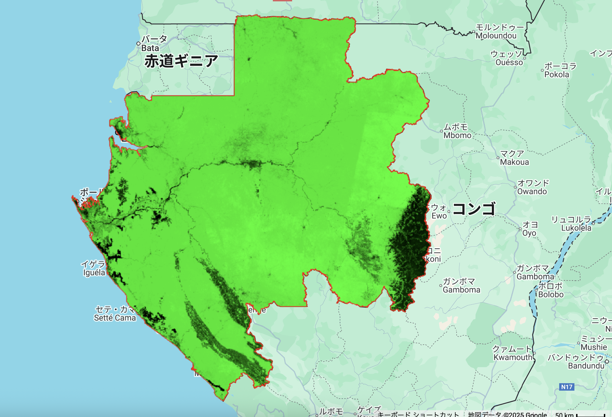

# National Tree Cover – GEE Learning Log

This note summarizes the learning from Section 12 of the [Google Earth Engine Mega Course](https://www.udemy.com/course/google-earth-engine-gis-remote-sensing/learn/lecture/42984576#overview),
focusing on visualizing national tree cover using the Hansen Global Forest Change v1.12 dataset.

---

## What This Script Does

- Loads **Hansen Global Forest Change v1.12 (2000–2024)** dataset
- Extracts **tree cover (%) for the year 2000**
- Filters the region of interest to **Gabon**
- Displays tree cover clipped to Gabon boundary
- Adds a red outline of Gabon's national boundary

---

## Key Concepts

| Concept | Description |
|--------|-------------|
| `ee.Image("UMD/hansen/global_forest_change_2024_v1_12")` | Loads Hansen global forest change dataset |
| `treecover2000` | Represents percent tree cover (0–100%) for year 2000 |
| `.clip(roi)` | Restricts image to Gabon country boundaries |
| `.paint()` | Draws vector boundaries on the map |
| `Map.centerObject()` | Zooms map to the specified region |

---

## Output　Samples
map_hansen_treecover_2000_gabon.png : Tree cover map clipped to Gabon boundary

- Green areas = high tree cover
- Black areas = low or no tree cover
- Red outlines = Gabon national boundary

---

## Notes

### What is the Hansen Global Forest Change Dataset?
- **Dataset ID**: `UMD/hansen/global_forest_change_2024_v1_12`
- **Provider**: University of Maryland
- **Resolution**: 30 meters (Landsat-derived)
- **Temporal Coverage**: 2000–2024
- **Bands**: tree cover,lossyear, gain, etc. for forest change dynamics
- **treecover2000** band:
  - Pixel values range from 0–100 (% tree cover)
  - Based on Landsat observations from year 2000
- **Use Case**: Monitoring forest degradation, deforestation, and restoration over time

### What does `treecover2000` represent?

This band shows the percentage of tree canopy cover for each 30m pixel as of the year 2000.
A value of 100 means dense forest; 0 means no tree cover.

### What’s the difference between this dataset and PALSAR’s FNF Map?

| Dataset | Description |
|--------|-------------|
| Hansen Global Forest | Percent tree canopy cover (continuous 0–100), from Landsat |
| PALSAR FNF | Discrete 3-class map: Forest (1), Non-forest (2), Water (3) |

Hansen is more suitable when you need **continuous values or thresholding** (e.g., ≥30% for forest).  
PALSAR is best when categorical classification is sufficient.

---

## Reference

1. [Google Earth Engine Mega Course – Section 12](https://www.udemy.com/course/google-earth-engine-gis-remote-sensing/learn/lecture/42984576)
2. Global Forest Extent：[UMD/hansen/global_forest_change_2024_v1_12](https://developers.google.com/earth-engine/datasets/catalog/UMD_hansen_global_forest_change_2024_v1_12?hl=en)
3. World administrative boundaries：[USDOS/LSIB_SIMPLE/2017](https://developers.google.com/earth-engine/datasets/catalog/USDOS_LSIB_SIMPLE_2017?hl=ja)

