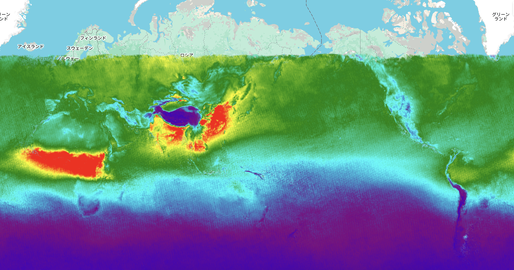

# Air Pollution Monitoring(Carbonmonoxide) – GEE Learning Log

This note summarizes the learning from Section 13 of the [Google Earth Engine Mega Course](https://www.udemy.com/course/google-earth-engine-gis-remote-sensing/learn/lecture/43212638).

---

## What This Script Does

- Loads **Sentinel-5P TROPOMI** air quality data for **CO (Carbon Monoxide)** concentration
- Filters for **January 2024**
- Computes the **monthly mean CO density** using `.mean()`
- Visualizes results using a color-coded palette over a global basemap

---

## Key Concepts

| Concept | Description |
|--------|-------------|
| `COPERNICUS/S5P/NRTI/L3_CO` | Sentinel-5P near real-time CO Level-3 data |
| `CO_column_number_density` | Tropospheric CO concentration in mol/m² |
| `.mean()` | Aggregates an image collection to a single image representing the mean of all images in the range |
| `palette` | Used to visualize high vs low CO concentrations |

---

## Output
### Output Samples
**Global Map of Carbon Monoxide (CO)**

- Global Map of Carbon Monoxide (CO)
  - Monthly mean from January 2024
  - Red areas indicate high CO concentration
  - Black/blue indicate low CO levels

---

## Notes
### Why visualize CO?
- **CO** is a major air pollutant from traffic, fires, and industry.
- Helps understand urban air quality, transboundary pollution, and seasonal variation.
- Especially relevant for **climate change**, **health risk**, and **policy planning**.

### What is Sentinel-5P TROPOMI?
- A European satellite mission for monitoring atmospheric gases.
- **COPERNICUS/S5P/NRTI/L3_CO** provides near real-time Level-3 data for carbon monoxide (CO).
- **Resolution**: ~7 km at nadir.
- **Update Frequency**: Near-daily, aggregated to monthly here.

### Why is there missing data in high-latitude regions (e.g. Russia, Arctic)?

The image created from Sentinel-5P data for January-February 2024 shows a lack of data in high-latitude regions such as Russia and the Arctic Circle. This is due to the following reasons:
- **Polar Night**: Sentinel-5P is a satellite in a sun-synchronous orbit and requires sunlight for its observations. During the winter months in the Northern Hemisphere (January-February), these high-latitude areas experience "polar night," where the sun does not rise. Without sunlight to reflect off the Earth's surface and atmosphere, the satellite cannot obtain valid observation data.
- **Cloud Cover**: In areas covered by thick clouds, the satellite's view of the ground is blocked, making it impossible to measure gas concentrations in the lower atmosphere. This can also result in data gaps.

Therefore, the blank areas on the map do not necessarily indicate an absence of CO, but rather an inability to collect data due to a lack of sunlight.

### What does `.mean()` do?
- It takes all images in the specified date range (January 2024) and computes the **pixel-wise average**.
- Useful for smoothing daily fluctuations and creating a **monthly composite**.

---

## Reference
1. Learning materials:[GEE Mega Course – Section 13: Air Pollution Monitoring](https://www.udemy.com/course/google-earth-engine-gis-remote-sensing/learn/lecture/43212638)
2. Carbon Monoxide:[COPERNICUS/S5P/NRTI/L3_CO](https://developers.google.com/earth-engine/datasets/catalog/COPERNICUS_S5P_NRTI_L3_CO?hl=ja#description)
