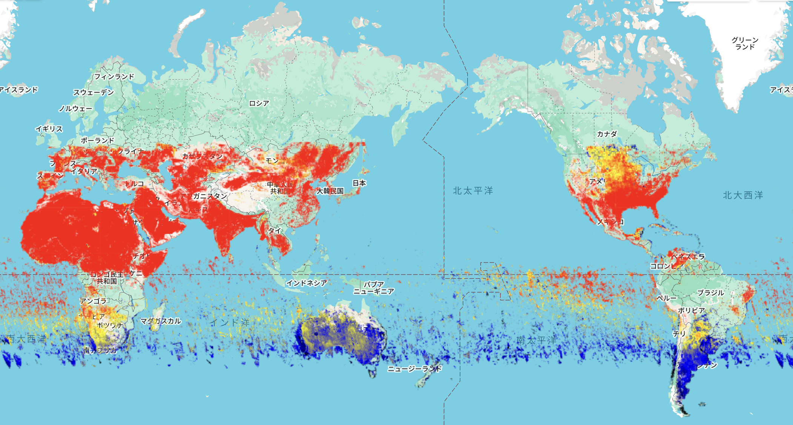

# Air Pollution Monitoring (Methane) – GEE Learning Log

This note summarizes the learning from Section 13 of the [Google Earth Engine Mega Course](https://www.udemy.com/course/google-earth-engine-gis-remote-sensing/learn/lecture/43212640).

## What This Script Does

- Loads **Sentinel-5P TROPOMI** air quality data for **CH4 (Methane)** concentration
- Filters for **January 2024**
- Computes the **monthly mean CH4 density** using `.mean()`
- Visualizes results using a color-coded palette over a global basemap

## Key Concepts

| Concept | Description |
|---------|-------------|
| `COPERNICUS/S5P/OFFL/L3_CH4` | Sentinel-5P offline methane Level-3 data |
| `CH4_column_volume_mixing_ratio_dry_air` | Column-averaged dry air mixing ratio of methane in parts per billion (ppb) |
| `.mean()` | Aggregates an image collection to a single image representing the mean of all images in the range |
| `palette` | Used to visualize high vs low CH4 concentrations |

## Output

### Output Samples

**Global Map of Methane (CH4)**
- Monthly mean from January 2024
- Red/yellow areas indicate high CH4 concentration
- Black/blue indicate low CH4 levels

## Notes

### Why visualize CH4?

- **CH4** is the second most important greenhouse gas after CO2, contributing significantly to climate change.
- Helps understand emission sources from agriculture, fossil fuel industry, waste management, and natural sources.
- Essential for **climate policy**, **emission reduction strategies**, and **environmental monitoring**.
- Supports **leak detection** in oil and gas operations and **compliance monitoring**.

### What is Sentinel-5P TROPOMI?

- A European satellite mission for monitoring atmospheric trace gases.
- **COPERNICUS/S5P/OFFL/L3_CH4** provides offline Level-3 data for methane (CH4).
- **Resolution**: ~1113.2 meters (approximately 1.1 km) pixel size.
- **Update Frequency**: 2-day revisit interval, providing near-daily global coverage.
- **Provider**: European Union/ESA/Copernicus program.
- **Data Availability**: February 2019 to present.

### What does `.mean()` do?

- It takes all images in the specified date range (January 2024) and computes the **pixel-wise average**.
- Useful for smoothing daily fluctuations and creating a **monthly composite**.
- Reduces noise and provides a more stable representation of methane concentrations over time.

### Use Cases for Methane Monitoring

- **Climate Change Mitigation**: Tracking global methane emissions to support climate targets
- **Industrial Monitoring**: Detecting leaks in oil and gas infrastructure
- **Agricultural Assessment**: Monitoring emissions from livestock and rice cultivation
- **Waste Management**: Tracking emissions from landfills and waste treatment facilities
- **Policy Support**: Providing data for emission inventories and regulatory compliance
- **Research**: Understanding methane sources and atmospheric chemistry

### Why is there missing data in high-latitude regions (e.g., Russia, Arctic)?

The methane data from Sentinel-5P TROPOMI shows significant data gaps in high-latitude regions such as Russia and the Arctic Circle during winter months (January-February). This is due to several fundamental limitations of satellite-based atmospheric observations:

**1. Polar Night Conditions**: 
- **Seasonal lack of solar radiation**: TROPOMI requires sunlight to measure atmospheric gases using near-infrared wavelengths
- **Polar night phenomenon**: During winter months, areas north of the Arctic Circle (approximately 66°34'N) experience polar night, where the sun does not rise above the horizon for extended periods
- **Solar zenith angle limitations**: Even when the sun is above the horizon, large solar zenith angles (>70°) significantly reduce measurement quality and reliability

**2. Technical Constraints**: 
- **Instrument sensitivity**: TROPOMI's methane retrieval algorithm requires sufficient solar illumination to detect the weak absorption signals in the near-infrared spectrum
- **Atmospheric scattering**: Large solar zenith angles increase atmospheric scattering, complicating the estimation of radiation path length through the atmosphere
- **Quality filtering**: Data with poor quality due to low light conditions are automatically filtered out to maintain product reliability

**3. Surface Conditions**: 
- **Snow and ice coverage**: Snow-covered surfaces have different reflectance properties that can affect the accuracy of atmospheric retrievals
- **Cloud cover**: Persistent cloud cover in polar regions during winter further limits the availability of clear-sky observations

**4. Orbital Characteristics**: 
- **Satellite coverage patterns**: While Sentinel-5P has a sun-synchronous orbit providing global coverage, the effectiveness of observations decreases significantly at high latitudes during winter
- **Data processing constraints**: Measurements with solar zenith angles exceeding certain thresholds (typically 70-80°) are excluded from standard processing
**5.Implications for Data Interpretations**: 
- **Temporal coverage**: High-latitude methane data is primarily available during spring, summer, and early autumn months
- **Seasonal bias**: Winter emissions from high-latitude sources (e.g., permafrost, industrial activities) may be underrepresented in annual averages
- **Research limitations**: Studies focusing on Arctic methane emissions must account for these seasonal data gaps

This limitation is not unique to methane observations but affects all TROPOMI trace gas products that rely on solar radiation for atmospheric retrievals. Alternative approaches, such as thermal infrared observations or ground-based measurements, are often used to complement satellite data in polar regions during winter months.

## Reference

1. Learning materials: [GEE Mega Course – Section 13: Air Pollution Monitoring](https://www.udemy.com/course/google-earth-engine-gis-remote-sensing/learn/lecture/43212640)
2. Methane Dataset: [COPERNICUS/S5P/OFFL/L3_CH4](https://developers.google.com/earth-engine/datasets/catalog/COPERNICUS_S5P_OFFL_L3_CH4)
3. Sentinel-5P Mission: [ESA Sentinel-5P](https://sentinels.copernicus.eu/web/sentinel/missions/sentinel-5p)
4. TROPOMI Instrument: [TROPOMI Official Website](https://www.tropomi.eu/)

