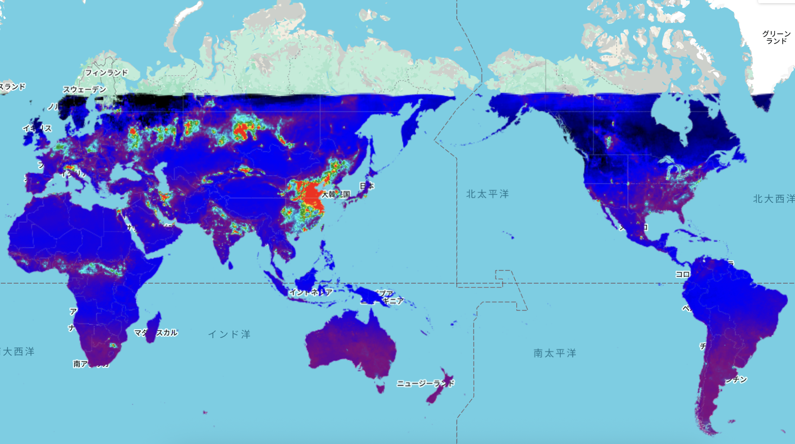

# Air Pollution Monitoring (Nitrogen Dioxide) – GEE Learning Log

This note summarizes the learning from Section 13 of the [Google Earth Engine Mega Course](https://www.udemy.com/course/google-earth-engine-gis-remote-sensing/learn/lecture/43212946).

## What This Script Does

- Loads **Sentinel-5P TROPOMI** air quality data for **NO2 (Nitrogen Dioxide)** concentration
- Filters for **January 2024**
- Computes the **monthly mean NO2 density** using `.mean()`
- Clips data to **country boundaries** using `collection.clip(countries)`
- Visualizes results using a color-coded palette over a global basemap
- Sets map center to coordinates **(65°E, 24°N)** with zoom level 2

## Key Concepts

| Concept | Description |
|---------|-------------|
| `COPERNICUS/S5P/NRTI/L3_NO2` | Sentinel-5P near real-time NO2 Level-3 data |
| `NO2_column_number_density` | Tropospheric NO2 concentration in mol/m² |
| `.mean()` | Aggregates an image collection to a single image representing the mean of all images in the range |
| `collection.clip(countries)` | Clips the data to continental boundaries using country feature collection |
| `Map.setCenter(65, 24, 2)` | Sets map center to specific coordinates with zoom level |
| `palette` | Used to visualize high vs low NO2 concentrations |

## Output

### Output Samples
**Global Map of Nitrogen Dioxide (NO2)**

**Global Map of Nitrogen Dioxide (NO2)**
- Monthly mean from January 2024
- Red/yellow areas indicate high NO2 concentration
- Black/blue indicate low NO2 levels
- Data clipped to country boundaries

## Notes

### Why visualize NO2?

- **NO2** is a major air pollutant from traffic, industrial activities, and fossil fuel combustion.
- Helps understand urban air quality, industrial emissions, and transportation impacts.
- Essential for **public health monitoring**, **environmental policy**, and **emission reduction strategies**.
- Supports **air quality assessment** and **regulatory compliance**.

### What is Sentinel-5P TROPOMI?

- A European satellite mission for monitoring atmospheric trace gases.
- **COPERNICUS/S5P/NRTI/L3_NO2** provides near real-time Level-3 data for nitrogen dioxide (NO2).
- **Resolution**: Approximately 3.5 × 7 km at nadir.
- **Update Frequency**: 2-day revisit interval, providing near-daily global coverage.
- **Provider**: European Union/ESA/Copernicus program.
- **Data Availability**: July 2018 to present.

### What does `.mean()` do?

- It takes all images in the specified date range (January 2024) and computes the **pixel-wise average**.
- Useful for smoothing daily fluctuations and creating a **monthly composite**.
- Reduces noise and provides a more stable representation of NO2 concentrations over time.

### What is the purpose of clip function`collection.clip(countries)` in this script ?

- **Purpose**: Clips the satellite data to continental boundaries
- **Data Source**: Uses `USDOS/LSIB_SIMPLE/2017` country boundaries feature collection
- **Effect**: Removes data over oceans and focuses on land areas where NO2 sources are located
- **Benefit**: Improves visualization by highlighting terrestrial emission sources

### Map.setCenter() vs Map.centerObject()

**Map.setCenter(65, 24, 2):**
- Sets map center to **specific coordinates** (65°E longitude, 24°N latitude)
- Requires **manual specification** of longitude, latitude, and zoom level
- **Fixed positioning** regardless of data extent
- Coordinates (65°E, 24°N) center the view on **South/Central Asia region**

**Map.centerObject():**
- Centers map on a **specific Earth Engine object** (image, feature, geometry)
- **Automatically calculates** optimal center and zoom level based on object bounds
- **Dynamic positioning** that adapts to data extent
- Example: `Map.centerObject(countries, 2)` would center on the country boundaries

**When to use each:**
- Use `Map.setCenter()` for **consistent viewing** of specific geographic regions
- Use `Map.centerObject()` for **data-driven centering** that adapts to your analysis area

### Use Cases for NO2 Monitoring

- **Air Quality Assessment**: Monitoring urban pollution levels and trends
- **Traffic Analysis**: Identifying high-emission transportation corridors
- **Industrial Monitoring**: Tracking emissions from power plants and factories
- **Policy Support**: Providing data for emission regulations and compliance
- **Health Studies**: Supporting epidemiological research on air pollution impacts
- **Urban Planning**: Informing city development and transportation planning

### Why is there missing data in high-latitude regions (e.g., Russia, Arctic)?

The nitrogen dioxide data from Sentinel-5P TROPOMI shows significant data gaps in high-latitude regions such as Russia and the Arctic Circle during winter months (January-February). This is due to several fundamental limitations of satellite-based atmospheric observations:

#### 1. Solar Zenith Angle Limitations
- **Critical threshold**: TROPOMI NO2 retrievals require solar zenith angles less than approximately 80-85°
- **Winter constraints**: During winter months at high latitudes, solar zenith angles exceed these thresholds
- **Quality filtering**: Data with solar zenith angles above 81.2° are automatically filtered out in standard processing
- **Seasonal variation**: Valid retrievals drop from 50-75% in summer to 0-20% in winter for high-latitude regions

#### 2. Polar Night Conditions
- **Extended darkness**: Areas north of the Arctic Circle experience polar night during winter months
- **No solar illumination**: TROPOMI requires sunlight for near-infrared spectroscopic measurements
- **Complete data absence**: No valid retrievals possible during polar night periods
- **Duration**: Polar night can last from several weeks to several months depending on latitude

#### 3. Cloud Cover Effects
- **Persistent cloudiness**: High-latitude regions experience significant cloud cover, especially in winter
- **Retrieval blocking**: Clouds prevent satellite sensors from observing atmospheric gases below
- **Combined impact**: Cloud cover compounds the solar zenith angle limitations
- **Quality assurance**: Cloudy pixels are filtered out using quality assurance values (typically >0.75 threshold)

#### 4. Technical and Processing Constraints
- **Algorithm limitations**: NO2 retrieval algorithms are optimized for moderate solar zenith angles
- **Increased uncertainty**: Large solar zenith angles increase atmospheric scattering and retrieval errors
- **Data quality**: Retrievals under poor illumination conditions have reduced accuracy and precision
- **Automatic filtering**: Quality control procedures remove low-quality data to maintain product reliability

#### 5. Atmospheric Scattering
- **Enhanced scattering**: Large solar zenith angles increase Rayleigh and Mie scattering in the atmosphere
- **Path length complications**: Longer atmospheric path lengths complicate radiative transfer calculations
- **Signal degradation**: Weak signals make it difficult to detect NO2 absorption features
- **Retrieval accuracy**: Reduced measurement sensitivity affects the reliability of concentration estimates

#### Implications for Data Interpretation

**Temporal Coverage:**
- High-latitude NO2 data is primarily available during spring, summer, and early autumn months
- Winter data coverage ranges from 0-20% of potential observations
- Peak data availability (50-75%) occurs during summer months

**Seasonal Bias:**
- Winter emissions from high-latitude sources may be underrepresented in annual averages
- This creates an inverse relationship between data availability and actual pollution levels
- NO2 pollution typically peaks in winter due to increased heating and reduced atmospheric mixing

**Research and Monitoring Limitations:**
- Studies focusing on Arctic NO2 emissions must account for seasonal data gaps
- Long-term trend analysis requires careful consideration of seasonal availability patterns
- Urban air quality monitoring in high-latitude cities faces significant winter data limitations

**Geographic Patterns:**
- Data availability decreases with increasing latitude
- Northern regions of Russia, Canada, and Scandinavia are most affected
- Southern boundaries of data gaps vary seasonally based on solar zenith angle constraints

This limitation affects all TROPOMI trace gas products that rely on solar radiation for atmospheric retrievals, including NO2, CH4, CO, and others. Alternative monitoring approaches, such as ground-based measurements or thermal infrared observations, are often used to complement satellite data in polar regions during winter months.

## Reference

1. Learning materials: [GEE Mega Course – Section 13: Air Pollution Monitoring](https://www.udemy.com/course/google-earth-engine-gis-remote-sensing/learn/lecture/43212946)
2. NO2 Dataset: [COPERNICUS/S5P/NRTI/L3_NO2](https://developers.google.com/earth-engine/datasets/catalog/COPERNICUS_S5P_NRTI_L3_NO2)
3. Country Boundaries: [USDOS/LSIB_SIMPLE/2017](https://developers.google.com/earth-engine/datasets/catalog/USDOS_LSIB_SIMPLE_2017)
4. Sentinel-5P Mission: [ESA Sentinel-5P](https://sentinels.copernicus.eu/web/sentinel/missions/sentinel-5p)
5. TROPOMI Instrument: [TROPOMI Official Website](https://www.tropomi.eu/)
6. High-latitude data limitations: [Schneider et al. (2021)](https://www.mdpi.com/2072-4292/13/11/2095)

