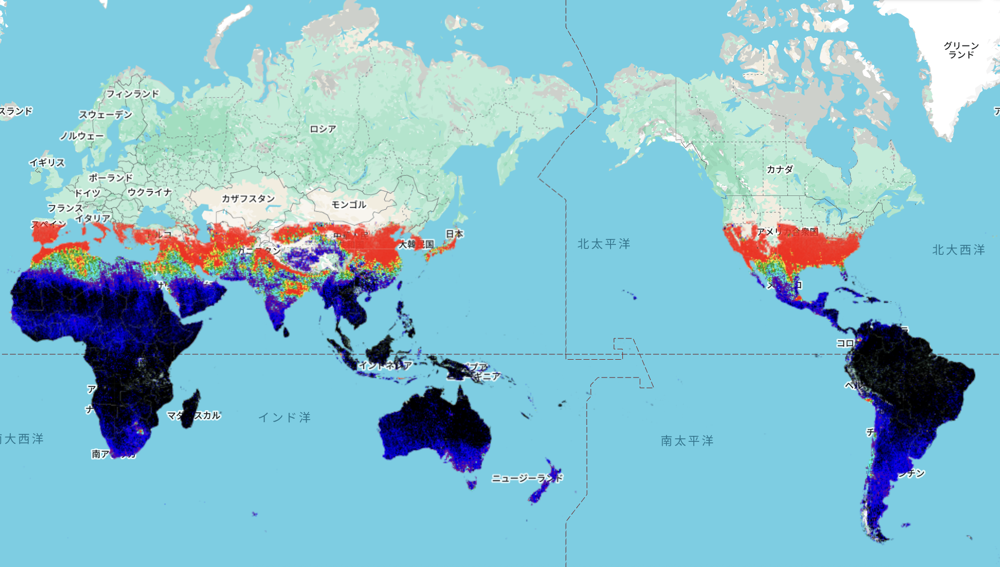

# Sulfur Dioxide Monitoring (SO₂) – GEE Learning Log

This note summarizes the learning from Section 13 of the [Google Earth Engine Mega Course](https://www.udemy.com/course/google-earth-engine-gis-remote-sensing/learn/lecture/43212966).

---

## What This Script Does

- Loads **Sentinel-5P TROPOMI** Level-3 data for **Sulfur Dioxide (SO₂)**
- Filters for **January 2024**
- Applies `.mean()` to get the monthly average
- Clips data to global country boundaries using `USDOS/LSIB_SIMPLE/2017`
- Visualizes SO₂ concentration using a multi-color palette

---

## Key Concepts

| Concept | Description |
|--------|-------------|
| `COPERNICUS/S5P/OFFL/L3_SO2` | Sentinel-5P SO₂ Level-3 offline data |
| `SO2_column_number_density` | SO₂ total column in mol/m² |
| `.mean()` | Averages multiple daily images into one composite |
| `.clip()` | Crops data to specific geometries (countries) |
| `Map.setCenter()` | Centers map on given coordinates and zoom level |

---

## Output

### Output Samples

**Global Map of Sulfur Dioxide (SO₂)**
- Monthly average for January 2024
- High values in red/yellow indicate possible volcanic or industrial emissions
- Low values in blue/black indicate cleaner air

---

## Notes

### What is the Sentinel-5P SO₂ Dataset?
- Dataset: `COPERNICUS/S5P/OFFL/L3_SO2`
- Provider: ESA (European Space Agency)
- Sensor: Sentinel-5P / TROPOMI
- Resolution: 
  - 3.5 × 5.5 km (across × along track) since August 6, 2019; 
  - initially 3.5 × 7.0 km at mission start
- Frequency: Near-daily; `.mean()` used here to create a monthly average
- Purpose: Detect SO₂ from natural sources (e.g., volcanoes) and anthropogenic emissions (e.g., power plants)

### Why Visualize SO₂?
- Sulfur dioxide is a toxic gas that contributes to acid rain and respiratory problems
- Monitoring helps detect industrial pollution, volcanic activity, and transboundary air pollution
- Useful for environmental health, disaster response, and regulatory compliance

### Why are polar regions missing?
- The Sentinel-5P satellite's orbit and sun-synchronous swath limit coverage at high latitudes (especially in winter)
- Data is less frequent or unavailable over regions like northern Russia or Antarctica

### What does `.mean()` do?
- Aggregates daily observations into a single monthly image
- Reduces noise and short-term fluctuations
- Ideal for time series visualization or regional comparison

### What does `collection.clip(countries)` do?
- Limits visualization to national borders defined by the `USDOS/LSIB_SIMPLE/2017` dataset
- Makes global visualization cleaner and focuses analysis on land areas

### What does `Map.setCenter(0.0, 0.0, 2)` do?
- Sets the map's center to **0° latitude, 0° longitude** with a zoom level of **2** (global view)

---

## Reference

- **Udemy**: [GEE Mega Course – Section 13: Air Pollution Monitoring](https://www.udemy.com/course/google-earth-engine-gis-remote-sensing/learn/lecture/43212966)
- **Dataset**: [COPERNICUS/S5P/OFFL/L3_SO2 – Sulfur Dioxide (SO₂)](https://developers.google.com/earth-engine/datasets/catalog/COPERNICUS_S5P_OFFL_L3_SO2#description)
- **Geometry**: [USDOS/LSIB_SIMPLE/2017 – Simplified Country Boundaries](https://developers.google.com/earth-engine/datasets/catalog/USDOS_LSIB_SIMPLE_2017)
