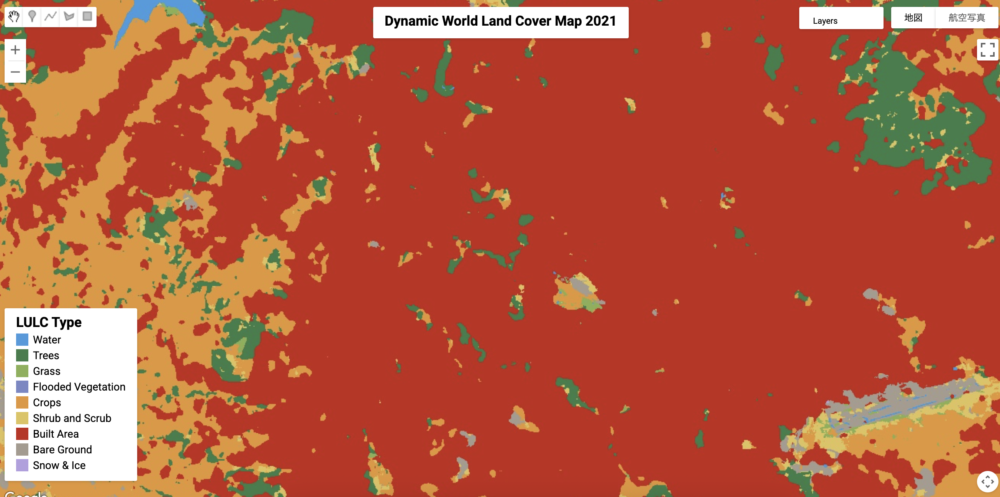
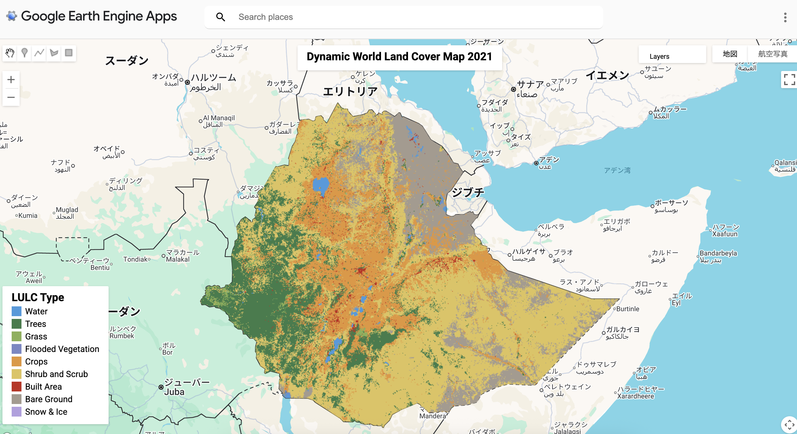

# Dynamic World Viewer – GEE Learning Log

This note summarizes the learning from [Google Earth Engine Mega Course – Section 14](https://www.udemy.com/course/google-earth-engine-gis-remote-sensing/learn/lecture/4266203).

---

## What This Script Does?

- Loads **Dynamic World v1** near-real-time land cover classification data for **Ethiopia in 2021**
- Creates a **mode composite** for the most frequently observed land cover class
- Computes **Top-1 confidence** and visualizes it with **hillshading**
- Displays the result with a **legend** and **map title** as a ready-to-share GEE App

---

## Key Concepts

| Concept               | Description                                                                 |
|-----------------------|-----------------------------------------------------------------------------|
| `GOOGLE/DYNAMICWORLD/V1` | Google AI-based land use/land cover classification product (10m resolution) |
| `.reduce(ee.Reducer.mode())` | Extracts most common land cover label for each pixel across time          |
| `.reduce(ee.Reducer.max())`  | Gets the highest class probability (confidence)                           |
| `ui.Panel`, `ui.Label`, `ui.Map` | Used to build GEE Apps (legend, titles, interactive UI)              |

---

## Output

### Output Samples

**Classified Composite**

**Probability Hillshade**

**Viewer App Screenshot**

### Image Descriptions

- Classified Composite: Most frequent land cover type per pixel (2021, Ethiopia)
- Probability Hillshade: Top-1 class confidence modulated with hillshade effect
- Viewer App Screenshot: Custom legend + title overlay + clipped results

---

## Notes

## What is Dynamic World?

### Unique Feature

- Unlike traditional land cover datasets that provide annual snapshots, **Dynamic World delivers per-scene classifications**, allowing for **sub-annual land cover monitoring**.
- A **global 10m land cover dataset** developed by **Google & World Resources Institute (WRI)**.
- Trained on **Sentinel-2 imagery** using deep learning.
- Provides **9 land cover classes** with **per-pixel probability scores**.
- Data available from **2015–present**, updated **near real-time**.

### Dataset Summary

| Item               | Description                                              |
|--------------------|----------------------------------------------------------|
| Provider           | Google & World Resources Institute (WRI)                 |
| Platform           | Google Earth Engine + Sentinel-2                         |
| Resolution         | 10 meters                                                |
| Temporal Frequency | Near real-time (scene-by-scene)                          |
| Coverage           | Global, from 2015 to present                             |

### Land Cover Classes (9 total)

1. **Water**
2. **Trees**
3. **Grass**
4. **Flooded Vegetation**
5. **Crops**
6. **Shrub & Scrub**
7. **Built Area**
8. **Bare Ground**
9. **Snow & Ice**

### Use Cases

- Detect **seasonal crop or vegetation** changes
- Monitor **urban expansion** or **deforestation**
- Support **disaster response** (e.g. floods, wildfires, droughts)
- Land cover change detection for **policy** and **environmental management**

---

### What’s the difference between "classified composite" and "probability hillshade"?

| Feature     | Classified Composite            | Probability Hillshade                         |
| ----------- | ------------------------------- | --------------------------------------------- |
| Output Type | One class per pixel (mode)      | Top-1 class confidence modulated by hillshade |
| Purpose     | Final land cover classification | Visualization of classification confidence    |
| Technique   | `.reduce(ee.Reducer.mode())`    | `.reduce(ee.Reducer.mean())` + `.max()`       |
| Appearance  | Sharp, crisp land cover map     | Smooth, shaded, highlights confidence         |
| Best Use    | Area statistics, masks, export  | Visual analysis, presentation layer           |

The classified composite is more deterministic, while the probability hillshade gives you a better idea of confidence and uncertainty.

---

### What does `.reduce(ee.Reducer.mode())` do?

- Selects the **most frequent label** (e.g., Crops, Trees, Water) at each pixel across the year.
- This helps summarize temporal data into a **single representative map**.

---

### What is "Top-1 Probability Hillshade"?

- For each pixel, selects the **highest probability class**.
- Applies hillshade effect based on confidence — higher certainty appears brighter.
- Adds 3D-like visualization to aid interpretation.

---

## Reference

1. [GEE Mega Course – Section 17: Dynamic World Viewer](https://www.udemy.com/course/google-earth-engine-gis-remote-sensing/learn/lecture/4266203)
2. [GOOGLE/DYNAMICWORLD/V1 – Dynamic World Land Cover](https://developers.google.com/earth-engine/datasets/catalog/GOOGLE_DYNAMICWORLD_V1)
3. [Dynamic World Explorer](https://dynamicworld.app)

