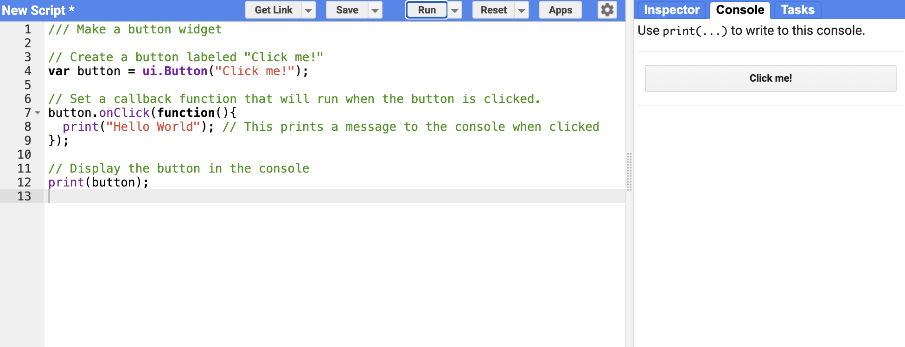

# UI Button Widget (Hello World) – GEE Learning Log

This note summarizes the learning from Section 14: Earth Engine Apps" of the [GEE Mega Course](https://www.udemy.com/course/google-earth-engine-gis-remote-sensing/learn/lecture/42661962).

---

## What This Script Does

- Demonstrates how to create a simple **UI button widget** in the Earth Engine Code Editor.
- When clicked, the button triggers a `print()` function to display `"Hello World"` in the console.
- This is a first step in building **interactive GEE Apps**.

---

## Key Concepts

| Concept         | Description |
|----------------|-------------|
| `ui.Button()`   | Creates a clickable button widget |
| `.onClick()`    | Binds a function that runs when the button is clicked |
| `print()`       | Displays output in the GEE console panel |

---

## Console Output

---

## Notes

### What is Google Earth Engine Apps?
- GEE Apps allow to build **interactive web tools** using Earth Engine code.
- Great for sharing analysis results with **non-coders**, stakeholders, or the public.
- Enable to build dashboards, monitoring tools, or decision-support systems.
- UI elements include buttons, panels, sliders, charts, and more.

### When an App should be created?
- When you want users to **interact with data** (e.g. select date, region, index).
- To present your analysis without giving access to the code.
- For publishing **dynamic, map-based tools** such as land cover classifiers or time series explorers.

### What is the `Docs` tab in the GEE Code Editor?
- It’s the **official Earth Engine API documentation** inside the editor.
- Shows the available methods, objects (e.g., `ui`, `Map`, `ee.Image`, `ee.Geometry`), and code examples.
- Use it when you:
  - Forget parameter order (e.g., `.filterBounds()` vs `.filterDate()`)
  - Want to explore optional arguments or advanced methods
  - Need examples for widgets or reducers

---

## Reference

1. [GEE Mega Course – Section 14: Earth Engine App Development](https://www.udemy.com/course/google-earth-engine-gis-remote-sensing/learn/lecture/42661962)
2. [Earth Engine API Reference](https://developers.google.com/earth-engine/apidocs/ui-button) in the Code Editor
