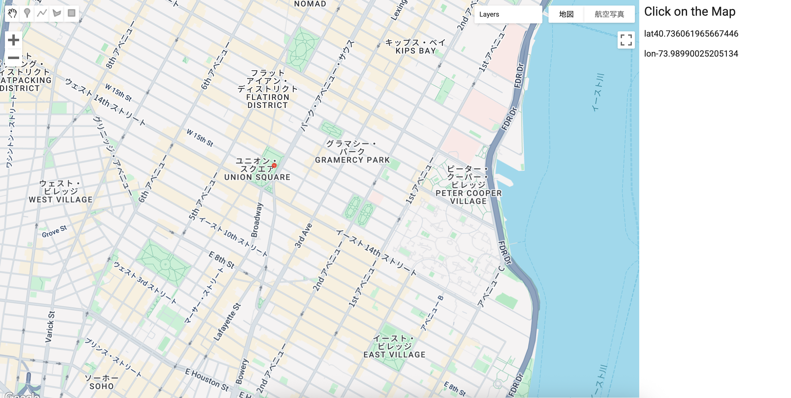

# LatLon Locator App – GEE Learning Log

This note summarizes the learning from Section 14 of the [Google Earth Engine Mega Course](https://www.udemy.com/course/google-earth-engine-gis-remote-sensing/learn/lecture/42662020).

---

## What This Script Does

- Creates a basic **GEE user interface (UI)** panel with latitude and longitude labels
- Adds a **map click event listener** that:
  - Displays the coordinates of the clicked location
  - Adds a red dot on the map at that location
- Useful as a UI utility for **inspecting locations**, **generating coordinates**, or preparing point-based analysis inputs

---

## Key Concepts

| Concept | Description |
|--------|-------------|
| `ui.Panel` | Creates a sidebar for UI layout |
| `Map.onClick()` | Registers a function triggered when the map is clicked |
| `setValue()` | Updates a UI label’s displayed value |
| `ee.Geometry.Point()` | Creates a geometry point object |
| `Map.layers().set()` | Replaces a layer in the map viewer by index |

---

## Console Output

### Description
- Screenshot of a functional UI panel on the left side
- Clicking on the map updates the latitude and longitude fields
- A red marker appears at the clicked location

---

## Notes

### What is this app useful for?
- This app provides a way to **interactively retrieve coordinates** by clicking on the map.
- Useful for locating positions to build geometry inputs for future analysis.

### What does `ui.root.add(sidebar)` do?
- Adds the side panel to the GEE interface so it's visible next to the map.

### What is `function(coords)`?
- It defines a **callback function** that takes `coords` (clicked coordinates) as input and executes logic when a click event occurs.

### What does `lon.setValue("lon" + coords.lon)` do?
- Sets the `lon` label to a string that combines `"lon"` with the numeric longitude value.
- Example: `"lon34.9782"`

### What does `Map.layers().set(1, dot)` do?
- Replaces the map’s **2nd layer (index 1)** with the new red dot showing the clicked point.
- This ensures only the latest point is shown on the map.

---

## Reference

1. [GEE Mega Course – Section 14: LatLon Locator](https://www.udemy.com/course/google-earth-engine-gis-remote-sensing/learn/lecture/42662020)
2. [UI Docs Panel & Map Events](https://developers.google.com/earth-engine/guides/ui_intro)
