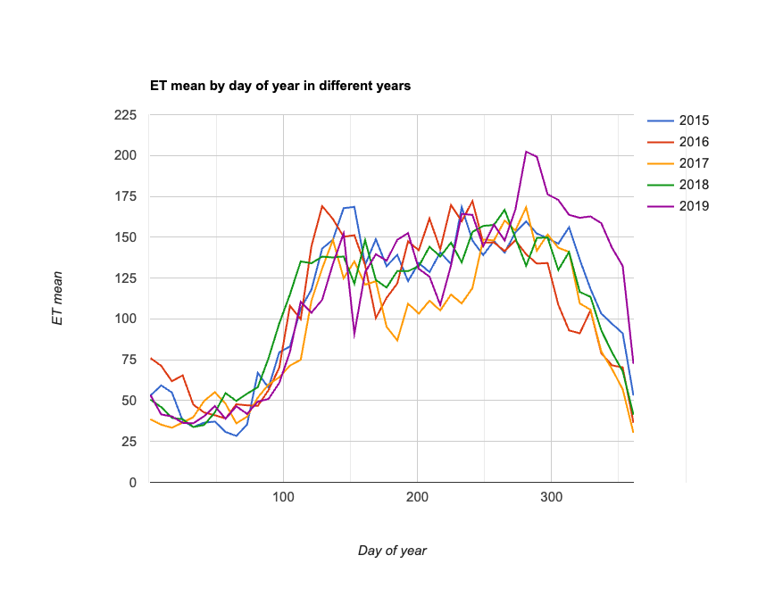

# MODIS ET (Evapotranspiration) DOY Timeseries – GEE Learning Log

This note summarizes the script and learning from Section 9: "ET DOY Timeseries Plot" of the [Google Earth Engine Mega Course](https://www.udemy.com/course/google-earth-engine-gis-remote-sensing/learn/lecture/42661852).

---

## What This Script Does

- Loads MODIS MOD16A2 8-day ET (Evapotranspiration) imagery
- Filters to Ethiopia from 2015–2019
- Selects the "ET" band
- Plots daily evapotranspiration trends over multiple years using `ui.Chart.image.doySeriesByYear()`

---

## Key Concepts

| Concept                            | Description |
|------------------------------------|-------------|
| `MODIS/006/MOD16A2`                | MODIS Terra Net Evapotranspiration product |
| `ET` band                          | Total evapotranspiration (mm/8 days × 10 scale) |
| `.select("ET")`                    | Selects ET band from multi-band image |
| `.doySeriesByYear()`               | Plots annual DOY timeseries by averaging over a region |
| `ee.Reducer.mean()`                | Computes mean ET over ROI per image |
| `scale: 500`                       | 500m pixel resolution (native to MOD16A2) |

---

## Output

A chart showing 8-day composite evapotranspiration trends for Ethiopia from 2015–2019.

### Sample Output


---

## Notes

### 1. What is `MOD16A2` and how is it different from `MOD11A2`?

| Dataset        | MOD11A2                        | MOD16A2                              |
|----------------|--------------------------------|--------------------------------------|
| Product        | Land Surface Temperature (LST) | Evapotranspiration (ET)              |
| Variable       | `LST_Day_1km`                  | `ET` (Evapotranspiration)            |
| Interval       | 8-day                          | 8-day                                |
| Resolution     | 1 km                           | 500 m                                |
| Unit (raw)     | Kelvin × 50                    | mm/8-days × 10                       |
| Use Cases      | Urban heat, surface temp.      | Water balance, agriculture, drought  |

→ MOD11A2 is used to monitor temperature, while MOD16A2 estimates how much water evaporates and transpires from surfaces and vegetation.

---

### 2. What does `.select("ET")` mean?

This selects the **Evapotranspiration band** ("ET") from the MODIS image.  
Although the variable is named `ET`, this `.select("ET")` refers to the band name, not the variable name.

---

### 3. What does this line do?

```javascript
var chart = ui.Chart.image.doySeriesByYear(ET, "ET", Ethiopia, ee.Reducer.mean(), 500);
```
→ This generates a DOY (Day of Year) line chart showing ET trends per year.

| Parameter        | Meaning                                          |
| ---------------- | ------------------------------------------------ |
| `ET`             | Image collection (MODIS MOD16A2)                 |
| `"ET"`           | Band to use in chart                             |
| `Ethiopia`       | FeatureCollection (region of interest)           |
| `Reducer.mean()` | Calculates average ET per image over the ROI     |
| `500`            | Pixel scale in meters (matches MODIS resolution) |


## Reference

-Udemy:
[GEE Mega Course – Section 9: Drought Monitoring](https://www.udemy.com/course/google-earth-engine-gis-remote-sensing/learn/lecture/42661852#overview)

-Datasets:

 - [MODIS/006/MOD16A2 – Evapotranspiration](https://developers.google.com/earth-engine/datasets/catalog/MODIS_NTSG_MOD16A2_105?hl=ja)

 - [USDOS/LSIB_SIMPLE/2017 – Country Boundaries](https://developers.google.com/earth-engine/datasets/catalog/USDOS_LSIB_SIMPLE_2017?hl=ja)
