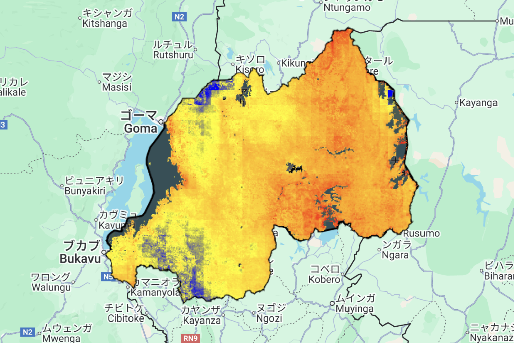
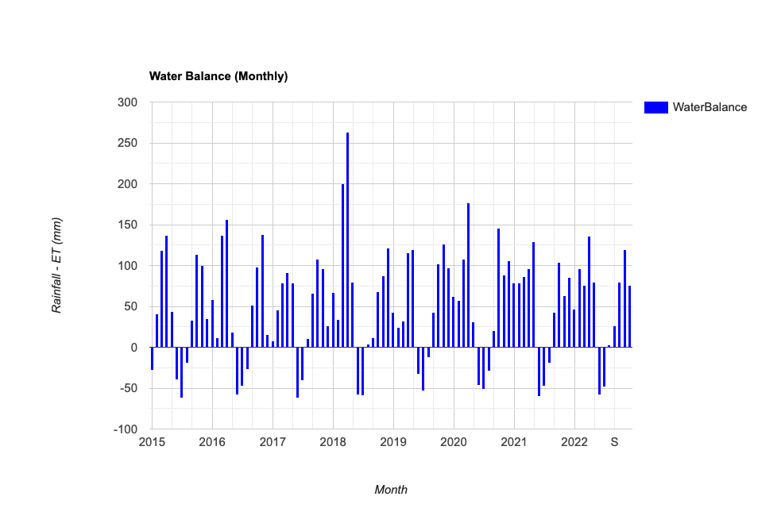

# Water Balance Monitoring (Rwanda) – GEE Learning Log

This note summarizes the workflow from Section 9: "Water Balance Monitoring" of the [Google Earth Engine Mega Course](https://www.udemy.com/course/google-earth-engine-gis-remote-sensing/learn/lecture/43492106#overview).

---

## What This Script Does

- Loads precipitation (CHIRPS) and evapotranspiration (MODIS MOD16A2) data
- Calculates monthly water balance = precipitation − ET
- Aggregates and visualizes the average monthly balance over Rwanda
- Displays result on map and time-series column chart

---

## Key Concepts

| Concept             | Description |
|---------------------|-------------|
| `CHIRPS`            | Daily rainfall (5-day PENTAD aggregated) |
| `MOD16A2`           | 8-day evapotranspiration estimates |
| `fromYMD()`         | Creates dates from year/month/day |
| `fromImages()`      | Constructs an image collection from nested map() |
| `calendarRange()`   | Filters by year/month |
| `subtract()`        | Computes water balance (P − ET) |
| `.multiply(0.1)`    | Applies scale factor to ET (MODIS unit conversion) |

---

## Outputs

- Raster layer showing the **mean monthly water balance** from 2015–2022


- Column chart of monthly water balance over Rwanda


---

## Notes
### What is Water Balance?

Water balance = Precipitation − Evapotranspiration (P − ET)  
It shows how much water remains after vegetation and soil have consumed water.

A **positive value** means water surplus, while **negative values** indicate deficit or drought.

### What are `startDate`, `endDate`, `years`, and `months`?

These are helper variables.
They define:
- The time range of the analysis (2015–2022)
- Lists of years and months used for looping and aggregation


### What happens in this block?

```javascript
var P = CHIRPS.filter(...).sum();
var ET = mod16.filter(...).sum().multiply(0.1);
var wb = P.subtract(ET).rename("waterbalance");
```
- Filters rainfall and ET by month and year
- Computes monthly total rainfall (P) from CHIRPS
- Computes monthly total evapotranspiration (ET) from MODIS, then applies scale factor (×0.1)
- Subtracts ET from precipitation to get monthly water balance
- Output is an image with a new band named "waterbalance"

###  What does `.fromImages(years.map(...months.map(...)))` do?

This block creates a new `ImageCollection` of monthly water balance images.

It loops over each combination of year and month:
- Filters precipitation and ET data for that specific month and year
- Computes the monthly **total rainfall** and **ET**
- Subtracts ET from precipitation to produce **monthly water balance**
- Attaches metadata: `"year"`, `"month"`, and `"system:time_start"`

Each loop iteration returns a single image, and all images are flattened into one collection.

```javascript
var waterBalance = ee.ImageCollection.fromImages(
  years.map(function(y){
    return months.map(function(m){
      var P = CHIRPS.filter(...).sum();
      var ET = mod16.filter(...).sum().multiply(0.1);
      var wb = P.subtract(ET).rename("waterbalance");
      return wb.set("year", y).set("month", m).set("system:time_start", ee.Date.fromYMD(y, m, 1));
    });
  }).flatten()
);
```

### What does `ui.Chart.image.seriesByRegion()` do?

This generates a **column chart** that plots **monthly water balance** over the selected region (Rwanda).  
Each bar represents **rainfall minus evapotranspiration (P − ET)** for a given month.  
It helps visualize seasonal trends in water availability.

---

## Reference

- **Udemy**:  
  [GEE Mega Course – Section 9: Water Balance Monitoring](https://www.udemy.com/course/google-earth-engine-gis-remote-sensing/learn/lecture/43492106)

- **Datasets**:
  - [UCSB-CHG/CHIRPS/PENTAD – Precipitation (5-day)](https://developers.google.com/earth-engine/datasets/catalog/UCSB-CHG_CHIRPS_PENTAD?hl=ja)
  - [MODIS/006/MOD16A2 – MODIS ET 8-day](https://developers.google.com/earth-engine/datasets/catalog/MODIS_006_MOD16A2)
  - [USDOS/LSIB_SIMPLE/2017 – Country Boundaries](https://developers.google.com/earth-engine/datasets/catalog/USDOS_LSIB_SIMPLE_2017)

